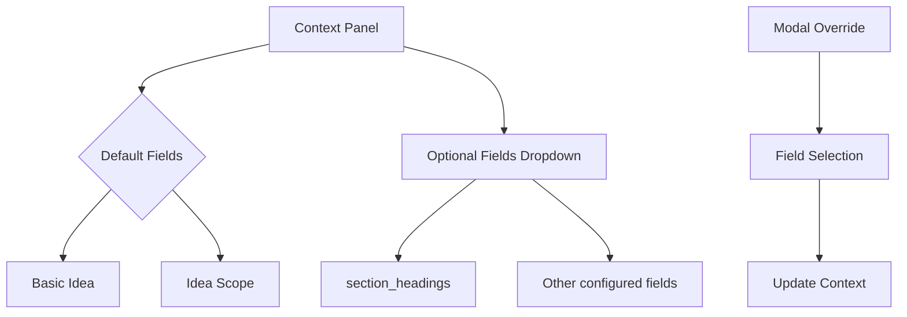
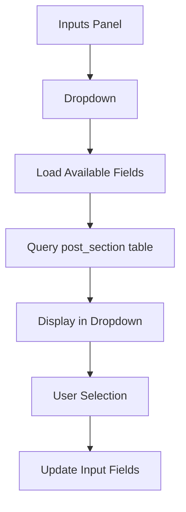
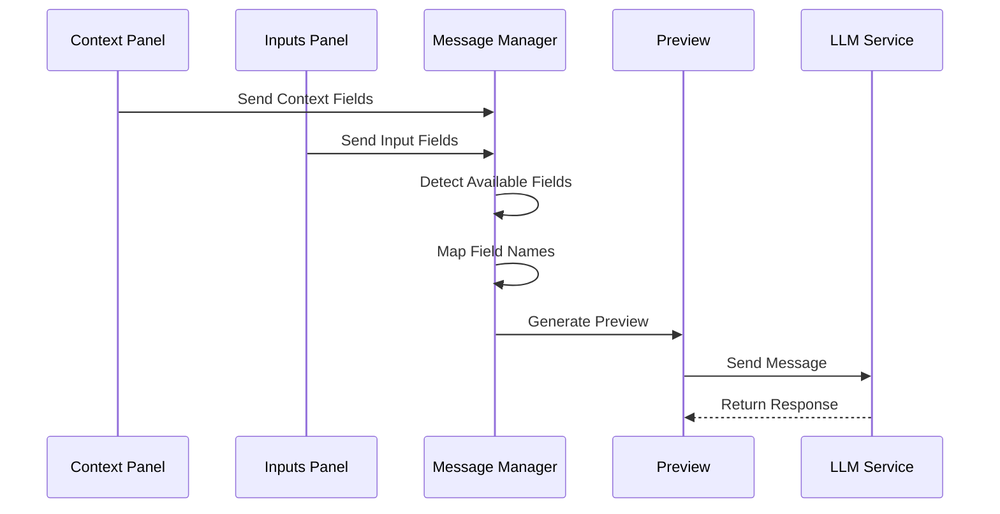

# LLM Message System Reference

## Overview

The LLM Message System manages the end-to-end process of assembling, previewing, and sending LLM prompts. This document serves as the single source of truth for the entire system.

## System Components

### 1. Input Sources

#### A. Context Inputs (Purple Panel - Context Section)
- **Source**: `post_development` table
- **Default Fields**:
  - `basic_idea`: Always included by default
  - `idea_scope`: Always included by default
- **Optional Fields**: Selected via dropdown
  - `section_headings`: Section structure data
  - Other fields as configured in workflow settings
- **Location**: First panel in purple area
- **Override**: Can be overridden via modal selection

#### B. Post Section Inputs (Purple Panel - Inputs Section)
- **Source**: `post_section` table
- **Field Selection**: Via dropdown in Inputs panel
- **Purpose**: Section-specific content inputs
- **Availability**: Based on current workflow stage

### 2. Field Selection System

#### A. Context Field Selection


#### B. Post Section Field Selection


### 3. Message Assembly Process



## Field Mapping and Validation

### 1. Context Fields
- **Table**: `post_development`
- **Default Fields**: Always included unless explicitly removed
- **Optional Fields**: Must be selected via dropdown
- **Validation**: Non-empty content required for inclusion

### 2. Post Section Fields
- **Table**: `post_section`
- **Selection**: Must be explicitly selected
- **Validation**: Must belong to current workflow stage
- **Availability**: Based on workflow configuration

## Message Preview Assembly

### 1. Field Detection
```javascript
// Enhanced LLM Message Manager
detectAvailableFields() {
    // Context Fields (post_development)
    const basicIdea = this.getFieldContent('basic_idea');
    const ideaScope = this.getFieldContent('idea_scope');
    
    // Always include if they have content
    if (basicIdea) fields.push({id: 'basic_idea', ...});
    if (ideaScope) fields.push({id: 'idea_scope', ...});
    
    // Optional context fields
    const sectionHeadings = this.getFieldContent('section_headings');
    if (sectionHeadings && isVisible('section_headings')) {
        fields.push({id: 'section_headings', ...});
    }
    
    // Post section fields (post_section)
    const selectedInputs = this.getSelectedInputFields();
    selectedInputs.forEach(field => {
        if (this.getFieldContent(field)) {
            fields.push({id: field, ...});
        }
    });
}
```

### 2. Preview Generation
- Assembles fields in consistent order
- Applies field name mapping
- Formats for LLM consumption
- Validates complete message

## API Endpoints

### 1. Field Loading
```http
GET /api/workflow/fields/context
```
Returns available context fields from post_development

```http
GET /api/workflow/fields/section
```
Returns available section fields from post_section

### 2. Message Preview
```http
POST /api/workflow/llm/preview
```
Generates message preview with selected fields

### 3. LLM Execution
```http
POST /api/workflow/llm/execute
```
Sends assembled message to LLM service

## UI Components

### 1. Purple Panel
- Context Section (post_development fields)
- Inputs Section (post_section fields)
- Preview Area
- LLM Settings

### 2. Modal Interface
- Field Selection Override
- Order Customization
- Preview Confirmation

## Error Handling

### 1. Field Validation
- Missing required fields
- Empty field content
- Invalid field combinations

### 2. Preview Generation
- Field assembly errors
- Format validation
- Size limitations

### 3. LLM Execution
- Service availability
- Response validation
- Error recovery

## Logging

### 1. Message Assembly
- Field selection events
- Content validation
- Preview generation

### 2. LLM Interaction
- Request payload
- Response data
- Error conditions

## Related Documentation

- [Workflow System Overview](README.md)
- [Database Schema](../database/schema.md)
- [API Reference](../api/current/README.md)
- [Field Mapping Configuration](formats.md)

## Testing

### 1. Field Selection
```bash
# Test context fields endpoint
curl -X GET "http://localhost:5000/api/workflow/fields/context"

# Test section fields endpoint
curl -X GET "http://localhost:5000/api/workflow/fields/section"
```

### 2. Preview Generation
```bash
# Test preview generation
curl -X POST "http://localhost:5000/api/workflow/llm/preview" \
  -H "Content-Type: application/json" \
  -d '{
    "context_fields": ["basic_idea", "idea_scope"],
    "section_fields": ["content", "draft"],
    "post_id": 1
  }'
```

### 3. End-to-End Testing
```bash
# Full message execution
curl -X POST "http://localhost:5000/api/workflow/llm/execute" \
  -H "Content-Type: application/json" \
  -d '{
    "message": "...",
    "post_id": 1,
    "settings": {
      "temperature": 0.7,
      "max_tokens": 1000
    }
  }'
```

## Changelog

### 2025-07-15
- Initial comprehensive documentation
- Added distinction between context and post_section inputs
- Documented default field behavior
- Added sequence diagrams for clarity 