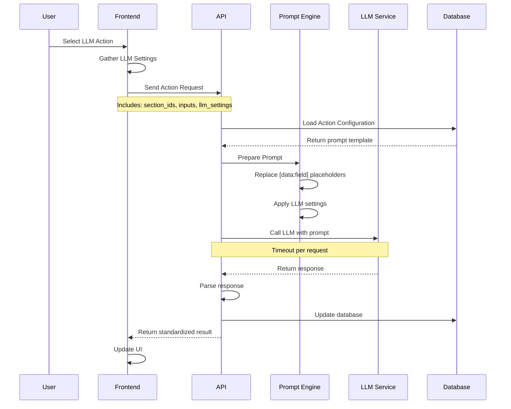
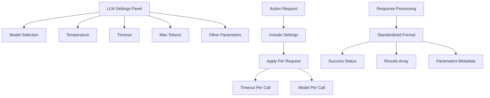

# Workflow Prompts Guide
 
## Overview
This guide documents the workflow prompt system, including system prompts and task prompts for each workflow stage.

## Data Flow and LLM Integration

### Prompt Processing Flow



### LLM Settings Integration



### Data Field Resolution

```mermaid
graph LR
    A[Prompt Template] --> B[Find [data:field] placeholders]
    B --> C[Resolve Field Source]
    C --> D[post_development table]
    C --> E[post_section table]
    C --> F[Future tables]
    
    G[Context Awareness] --> H[Current Section ID]
    G --> I[Current Post ID]
    
    J[Field Resolution] --> K[Fetch from correct table]
    K --> L[Use context for row selection]
    L --> M[Replace placeholder with value]
```

## Prompt Types

### 1. System Prompts
System prompts provide the base context and instructions for the LLM. They are not tied to specific workflow stages.

Example system prompt:
```
You are a helpful assistant focused on blog post development. You help authors:
1. Develop and refine ideas
2. Structure content effectively
3. Write engaging copy
4. Optimize for SEO
```

### 2. Task Prompts
Task prompts are specific to workflow stages and steps. They guide the LLM in performing specific tasks.

Example task prompt for "Initial Concept" step:
```
Given the idea seed: [data:idea_seed]

Generate a clear, concise basic idea for a blog post that:
1. Captures the core concept
2. Identifies the target audience
3. Outlines the value proposition
4. Suggests potential angles

Keep the response focused and actionable.
```

## LLM Settings and Configuration

### Settings Panel Integration
- **Location**: Purple panel on workflow pages
- **Components**: Model selection, temperature, timeout, max tokens
- **Application**: Settings applied per individual LLM request
- **Timeout**: Each section gets its own timeout window

### Response Standardization
All LLM responses follow a consistent structure:
```json
{
  "success": true,
  "results": [
    {
      "section_id": 1,
      "output": "Generated content",
      "parameters": {
        "model": "gpt-4",
        "temperature": 0.7,
        "tokens_used": 150
      }
    }
  ],
  "step": "action_name",
  "sections_processed": [1, 2, 3]
}
```

## Prompt Management

### Creating Prompts
1. System Prompts:
   ```bash
   curl -s -X POST "http://localhost:5000/settings/workflow_prompts" \
     -F "prompt_type=system" \
     -F "name=Base Context" \
     -F "prompt_text=You are a helpful assistant..."
   ```

2. Task Prompts:
   ```bash
   curl -s -X POST "http://localhost:5000/settings/workflow_prompts" \
     -F "prompt_type=task" \
     -F "stage=planning" \
     -F "substage=idea" \
     -F "step=Initial Concept" \
     -F "name=Generate Basic Idea" \
     -F "prompt_text=Given the idea seed..."
   ```

### Updating Prompts
```bash
curl -s -X POST "http://localhost:5000/settings/workflow_prompts" \
  -F "prompt_id=1" \
  -F "name=Updated Name" \
  -F "prompt_text=Updated text..."
```

### Deleting Prompts
```bash
curl -s -X POST "http://localhost:5000/settings/workflow_prompts" \
  -F "prompt_id=1" \
  -F "delete=true"
```

## Prompt Structure

### System Prompts
- Focus on general capabilities and context
- Define the assistant's role and expertise
- Set overall tone and style
- Establish constraints and guidelines

### Task Prompts
- Use [data:field_name] syntax for dynamic data
- Include clear instructions and expectations
- Specify desired output format
- Provide evaluation criteria

## Stage-Specific Prompts

### 1. Planning Stage

#### Idea Substage
1. Initial Concept
   ```
   Given the idea seed: [data:idea_seed]
   Generate a basic idea that...
   ```

2. Basic Idea
   ```
   Based on the initial concept: [data:basic_idea]
   Refine and expand the idea by...
   ```

3. Provisional Title
   ```
   Using the basic idea: [data:basic_idea]
   Generate an engaging title that...
   ```

#### Research Substage
1. Facts
   ```
   For the topic: [data:basic_idea]
   Research and list key facts that...
   ```

2. Concepts
   ```
   Based on the facts: [data:research_facts]
   Identify core concepts that...
   ```

#### Structure Substage
1. Outline
   ```
   Using the facts: [data:research_facts]
   And concepts: [data:research_concepts]
   Create a detailed outline that...
   ```

2. Allocate Facts
   ```
   Given the outline: [data:structure_outline]
   And facts: [data:research_facts]
   Distribute facts across sections...
   ```

### 2. Writing Stage

#### Content Substage
1. Section Headings
   ```
   Based on the outline: [data:structure_outline]
   Generate section headings and descriptions...
   ```

2. Section Content
   ```
   For section: [data:section_heading]
   Using allocated facts: [data:section_facts]
   Write engaging content that...
   ```

#### Review Substage
1. Content Review
   ```
   Review the section: [data:section_content]
   For clarity, engagement, and...
   ```

### 3. Publishing Stage

#### Preflight Substage
1. Review
   ```
   Review all content: [data:content_draft]
   And metadata: [data:meta_info]
   Ensure compliance with...
   ```

2. Validation
   ```
   Validate the post against...
   ```

## Best Practices

1. Data References
   - Always use [data:field_name] syntax
   - Reference only fields available in the current context
   - Verify field names in post_development and post_section tables

2. Prompt Design
   - Keep instructions clear and specific
   - Include examples where helpful
   - Define expected output format
   - Consider edge cases

3. Context Management
   - Maintain consistent context across stages
   - Pass relevant information forward
   - Avoid redundant instructions

4. Error Handling
   - Include fallback instructions for missing data
   - Specify what to do if LLM response is invalid
   - Provide clear success criteria

5. LLM Settings
   - Use appropriate temperature for creativity vs consistency
   - Set reasonable timeouts for each action type
   - Monitor token usage for cost optimization

## Universal Input Mapping

### Current System
- Input mappings are hardcoded to specific tables
- Limited flexibility for different data sources
- No dynamic table selection

### Future Enhancement
- Allow table selection for each input/output mapping
- Support multiple tables: post_development, post_section, future tables
- Context-aware field resolution based on current section/post

### Implementation Plan
1. **Database Schema**: Add table reference to field mappings
2. **UI Enhancement**: Expand field mapping interface
3. **Backend Logic**: Update field resolution to use specified tables
4. **Documentation**: Update all relevant docs with new capabilities 