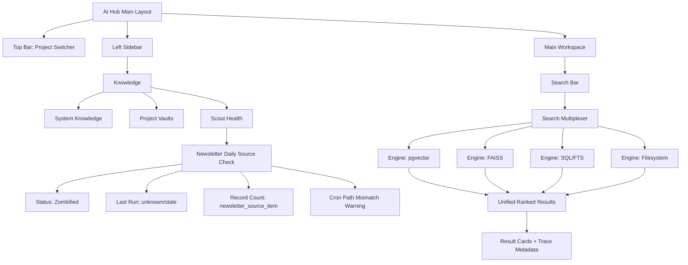

# KNOWLEDGE_UI_SPEC

Status: Active  
Updated: 2026-03-20  
Scope: AI Hub project-aware knowledge interface design (backend contracts + UI behavior)  
Source of truth inputs: `docs/INTERNAL_KNOWLEDGE_FORENSICS.md`, `docs/SYSTEM_ARCHITECTURE_v3.md`

## 1) Purpose

Define a project-agnostic architecture for representing heterogeneous knowledge resources (PostgreSQL tables, pgvector, FAISS-capable stores, filesystem corpora, and ingestion/scout services) in one unified, project-aware AI Hub interface.

This document is design-only. It does not implement code and does not change scheduler paths.

## 2) Design Principles

- Project isolation remains mandatory (`project_id` as hard scope boundary).
- Vaults are first-class resource objects, not string labels.
- Search is capability-routed (semantic vs lexical vs structured) and audit-traceable.
- Service health is observable in UI from runtime evidence, not assumptions.
- Mixed-state resources (`Active`, `Deprecated`, `Unknown`, `Zombified`) are displayed explicitly.

## 3) Vault Registry Schema (Extension to `config/projects.json`)

## 3.1 Current Gap

Current `knowledge_vaults` model uses simple names. Forensics shows resource diversity requiring typed definitions:
- SQL tables (`blog.public.families`, `blog.public.clan_kb_articles`)
- pgvector collections (`aihub.public.embeddings`)
- FAISS-capable code paths (`blog/utils/vector_search/*`)
- Filesystem corpora (`shared_docs/system`, `law_data`, `rawdata`)
- Scout jobs (`daily_source_check.py`, `prefetch_sources.py`)

## 3.2 Proposed Shape

Add a `vault_registry` object per project, containing explicit `resources`.

```json
{
  "projects": [
    {
      "project_id": "blog",
      "display_name": "BlogForge",
      "root_dir": "/Users/autojenny/Documents/projects/blog",
      "database": {
        "engine": "postgresql",
        "dsn_env": "BLOG_DATABASE_URL",
        "schema": "public"
      },
      "vault_registry": {
        "version": "1.0",
        "resources": [
          {
            "resource_id": "vault.blog.families.sql",
            "label": "Families Vault",
            "resource_type": "postgres_table",
            "status": "active",
            "domain": "domain_knowledge",
            "location": {
              "database": "blog",
              "schema": "public",
              "table": "families"
            },
            "capabilities": ["lookup", "filter", "keyword_search"],
            "search_function": "search_postgres_table",
            "metrics": {
              "record_count_query": "SELECT count(*) FROM public.families",
              "updated_at_column": "updated_at"
            }
          },
          {
            "resource_id": "vault.blog.kb.sql",
            "label": "Clan KB Articles",
            "resource_type": "postgres_table",
            "status": "active",
            "domain": "domain_knowledge",
            "location": {
              "database": "blog",
              "schema": "public",
              "table": "clan_kb_articles"
            },
            "capabilities": ["lookup", "keyword_search", "fts"],
            "search_function": "search_postgres_fts",
            "metrics": {
              "record_count_query": "SELECT count(*) FROM public.clan_kb_articles"
            }
          },
          {
            "resource_id": "vault.blog.semantic.faiss",
            "label": "Blog Semantic Index",
            "resource_type": "faiss_index",
            "status": "unknown",
            "domain": "domain_knowledge",
            "location": {
              "code_path": "utils/vector_search/retrieval.py",
              "index_path": "data/vector_index/products_categories.faiss",
              "metadata_path": "data/vector_index/products_categories_metadata.json"
            },
            "capabilities": ["semantic_search"],
            "search_function": "search_faiss_contentretriever",
            "source_material": ["blog.public.content_chunks"],
            "health_checks": [
              "path_exists:index_path",
              "path_exists:metadata_path"
            ]
          },
          {
            "resource_id": "vault.blog.scout.daily_source_check",
            "label": "Newsletter Daily Source Check",
            "resource_type": "scout_service",
            "status": "zombified",
            "domain": "operations",
            "location": {
              "cron_entry": "0 6 * * * ... /Users/autojenny/Documents/projects/blog/blog-core/newsletter/jobs/daily_source_check.py ...",
              "expected_script_path": "/Users/autojenny/Documents/projects/blog/archives/legacy_services/blog-core/newsletter/jobs/daily_source_check.py",
              "log_path": "/Users/autojenny/Documents/projects/blog/logs/newsletter_prefetch.log"
            },
            "capabilities": ["health_monitoring", "last_run_tracking", "record_count_tracking"],
            "search_function": "none",
            "metrics": {
              "record_count_query": "SELECT count(*) FROM public.newsletter_source_item",
              "last_run_source": "cron_log_or_job_ledger"
            }
          }
        ]
      }
    }
  ]
}
```

## 3.3 Resource Type Enum

- `postgres_table`
- `postgres_view`
- `postgres_vector` (pgvector-backed)
- `faiss_index`
- `filesystem_corpus`
- `scout_service`
- `api_source`

## 3.4 Required Resource Fields

- `resource_id` (globally unique)
- `resource_type`
- `status` (`active`, `deprecated`, `unknown`, `zombified`)
- `domain` (`system_knowledge`, `domain_knowledge`, `operations`)
- `location` (type-specific locator)
- `capabilities` (search/monitor capability flags)
- `search_function` (named backend resolver key)

## 3.5 Optional Resource Fields

- `source_material` (upstream corpus/tables)
- `metrics` (record count query, freshness fields)
- `health_checks` (path exists, table exists, cron match, etc.)
- `ownership` (project or subsystem owner)
- `tags` (e.g., `newsletter`, `family`, `legal`)

## 4) Active Intelligence Dashboard (Scouts)

## 4.1 Goal

Provide a top-level operational panel in AI Hub showing ingestion/scout viability and drift signals for each project.

## 4.2 First Monitored Service (from Forensics)

Service: `daily_source_check.py`  
Detected issue: cron target path mismatch (`blog-core` root path missing; script exists under `archives/legacy_services/blog-core/...`)  
Required UI state: `Zombified`

## 4.3 UI Data Contract

For each scout row:
- `project_id`
- `service_id`
- `service_label`
- `last_run_at` (nullable)
- `status` (`Alive`, `Degraded`, `Zombified`, `Unknown`)
- `record_count` (table-specific, e.g., `newsletter_source_item`)
- `path_exists` (bool for expected script path)
- `cron_target_exists` (bool)
- `error_summary` (short diagnostic)

## 4.4 Status Rules

- `Alive`: scheduled target path exists and run evidence is recent.
- `Degraded`: target exists but recent run failed or stale.
- `Zombified`: cron configured but points to non-existent script path.
- `Unknown`: insufficient telemetry.

## 4.5 Backend Endpoints (Specification Only)

Implemented Research Command Center endpoints:
- `GET /api/research/sources?project_id=<id>`
  - Returns the transient "Source Fleet" rows plus `scout_health` evidence (`Alive`, `Zombified`, `Unknown`) per configured outlet.
- `GET /api/research/vaults?project_id=<id>`
  - Returns the stable Reference Library vault summaries (`postgres_table` resources): `resource_id`, `label`, `schema`, `table`, `record_count`, `last_updated_at`.
- `GET /api/research/items?project_id=<id>&limit=<n>`
  - Default mode: returns recent harvested "Intel" items for the project's configured `item_table`.
  - Drill-down mode: when `resource_id` is provided for a `postgres_table` vault, returns a data sample of the last rows for that vault (Proof of Life).

## 5) Search Multiplexer Design (Knowledge Sidebar)

## 5.1 Problem

Search must route across different engines:
- AI Hub pgvector (`aihub.public.embeddings`)
- Blog FAISS-capable semantic layer (via ContentRetriever)
- Structured SQL vaults
- Filesystem corpora

## 5.2 Multiplexer Inputs

- `project_id`
- `query_text`
- `intent` (semantic, lexical, structured, operations)
- `resource_filters` (optional vault selection)
- `result_limit`

## 5.3 Routing Strategy

1. Resolve active project registry from `config/projects.json`.
2. Load enabled `vault_registry.resources` for project plus shared system resources.
3. Infer query intent:
   - Architecture/rules/standards terms -> bias `system_knowledge`.
   - Entity/fact queries -> bias project domain resources.
   - Operational terms (`cron`, `run`, `status`, `ingest`) -> include scout resources first.
4. Build execution plan:
   - Semantic plan:
     - If `postgres_vector` exists and healthy, query pgvector.
     - If `faiss_index` exists and healthy, query FAISS path.
   - Lexical/structured plan:
     - Query SQL/FTS resources.
     - Query filesystem corpus index.
5. Fuse results:
   - Normalize score per engine.
   - Apply domain bonus/penalty by intent and project scope.
   - Deduplicate by canonical source key.
6. Return ranked list plus trace block:
   - engine used
   - resource_ids hit
   - skipped resources and reasons

## 5.4 Decision Rules (Deterministic)

- Never query another project's domain resources unless explicitly switched.
- If semantic engine is unavailable, degrade to lexical search, never fail hard.
- If both pgvector and FAISS are available:
  - Use both in parallel for semantic intent.
  - Merge with calibrated normalization.
- If FAISS index path missing but FAISS code exists:
  - mark FAISS resource `unknown/degraded`
  - continue with pgvector/lexical fallback.

## 5.5 Multiplexer Output Shape

```json
{
  "query": "file length rule",
  "project_id": "no13edinburgh",
  "results": [
    {
      "title": "AI_HUB_ORIENTATION",
      "resource_id": "vault.shared.system.docs",
      "engine": "filesystem_lexical",
      "score": 0.91,
      "path": "shared_docs/system/AI_HUB_ORIENTATION.md"
    }
  ],
  "trace": {
    "intent": "system_rules",
    "engines_used": ["pgvector", "filesystem_lexical"],
    "resources_queried": ["vault.aihub.embeddings.pgvector", "vault.shared.system.docs"],
    "resources_skipped": [
      {
        "resource_id": "vault.blog.semantic.faiss",
        "reason": "index_path_missing"
      }
    ]
  }
}
```

## 6) UI Specification and Wireframe

## 6.1 New Left Sidebar Sections

- `Knowledge`
  - `System Knowledge`
  - `Project Vaults`
  - `Scout Health`

## 6.2 Scout Health Panel Fields

- Service name
- Status badge
- Last run timestamp
- Record count
- Path mismatch warning (if any)

## 6.3 Mermaid Wireframe



## 7) Backend-UI Integration Sequence

1. User selects `project_id` in top bar.
2. UI loads project `vault_registry`.
3. Sidebar renders vault cards and scout rows from registry + telemetry endpoint.
   - Vault drill-down: clicking a `postgres_table` vault card requests `/api/research/items` with the vault `resource_id` and renders the returned row sample as a "Data Sample" table in the detail pane.
4. User submits search query.
5. Multiplexer builds query plan from registry capabilities.
6. Results and trace are rendered in unified list.
7. Scout status panel refreshes on interval (read-only telemetry).

## 8) Non-Goals (This Spec)

- No scheduler fixes.
- No migration scripts.
- No runtime code changes.
- No UI implementation commits.

## 9) Review Checklist

- Registry schema supports mixed resource types.
- Scout dashboard can represent Alive/Zombified states with objective signals.
- Multiplexer logic preserves strict project isolation.
- Wireframe maps to current AI Hub layout model.

## 10) Resource Presentation & Fact Card Specification

## 10.1 Scope

This section defines the UI "contracts" (visual + interaction) for how knowledge resources render in:
- AI Hub search results (unified ranked list)
- Sidebar knowledge cards (project vault excerpts)

It defines templates, a universal card wrapper, and deterministic interaction behavior.

This is presentation-only. No backend or cron changes are introduced here.

## 10.2 Resource-to-Template Mapping

The UI chooses a card template based on:
1. `resource_type` (typed registry resource object)
2. project domain lane derived from `resource.domain` (`domain_knowledge`, `system_knowledge`, `operations`)
3. project_id (strict isolation boundary)

Domain → template set:
- `blog` (Heritage): `TartanFactCard`, `FamilyFactCard`
- `scots.law` (Legal): `StatuteFactCard`, `CaseFactCard`
- `novels` (Creative): `CharacterFactCard`

Fallback behavior (if template not defined):
- Use `GenericFactCard` (still inside the universal wrapper) with key-value pairs for the fields returned by the search engine.

## 10.3 Presentation Templates (Per Project Domain)

### 10.3.1 Blog (Heritage)

#### A) `TartanFactCard`
Fields (contract):
- `Thumbnail` (image or image placeholder)
- `Name` (primary title)
- `Family Link` (clickable link to the owning family/vault entity)
- `Registration Date` (date string; may be nullable)

Field formatting rules:
- Thumbnail: fixed aspect ratio thumbnail; if missing, show a deterministic placeholder (e.g., initials or neutral icon derived from tartan name).
- Family Link: must be rendered as an in-app navigation link to the trace of the family entity (not an external URL).
- Registration Date: display as `YYYY-MM-DD` when parseable; otherwise render raw string with an "Unknown" label tag.

#### B) `FamilyFactCard`
Fields (contract):
- `Name` (primary title)
- `Clan Status` (enum-like value, render as badge)
- `Septs` (list; show first N and provide "View all" inside expanded view)
- `OID` (object identifier; render as monospace)

Field formatting rules:
- Clan Status: show as badge with color mapped to status.
- Septs: if list length > N, show `+<count> more` and require explicit expand for full list.
- OID: monospace rendering; include full value in expanded view.

### 10.3.2 Scots.law (Legal)

#### A) `StatuteFactCard`
Fields (contract):
- `Act Title` (primary title)
- `Year` (numeric; badge if present)
- `Section` (string)
- `Citation` (canonical citation string)

Field formatting rules:
- Citation must be treated as the canonical short source label shown in both footer and expanded view.
- Year displayed as a badge when present; if unknown, omit the badge (do not show `0`).

#### B) `CaseFactCard`
Fields (contract):
- `Parties` (string; may be formatted `Claimant v Defendant`)
- `Court` (string)
- `Date` (date string)
- `Holding Summary` (short textual summary; should be the "fact" payload, not just metadata)

Field formatting rules:
- Holding Summary should be visually emphasized as the main body excerpt (first text block).
- Parties/Court are metadata; still displayed as key-value pairs.

### 10.3.3 Novels (Creative)

#### A) `CharacterFactCard`
Fields (contract):
- `Name` (primary title)
- `Role` (string; e.g., protagonist/antagonist/support)
- `Traits` (list; show first N and expand on demand)
- `Last Appearance` (string/date; may be nullable)

Field formatting rules:
- Traits: render as compact chips; if missing, omit chips area and show a single-line fallback `Traits unavailable`.
- Last Appearance: if null, render `Last Appearance: Unknown` in expanded view only.

## 10.4 Universal "Card Wrapper" (Applies to Every Fact Card)

Tailwind CSS conventions:
- Use Tailwind utility-first classes in line with `docs/system/TECH_STANDARDS.md` (no one-off custom CSS).
- Card must use shared theme variables (colors, borders) consistent with the AI Hub style system.

Card structure (mandatory):

### 10.4.1 Header
Must include:
- Resource Icon (derived from resource domain/type; e.g., `🏛️` for statutes/cases, `🏳️` for tartans, `🧾` for citations)
- Type Label (human-readable type name; e.g., `Statute`, `Case`, `Tartan`, `Family`, `Character`)

Header layout contract:
- Must fit on one line at sidebar width.
- Icon and label must remain stable between collapsed and expanded views.

### 10.4.2 Body
Must include:
- Key-value metadata pairs for the fields required by the active template.
- Values must be rendered in consistent typography hierarchy:
  - Primary title: prominent
  - Secondary fields: smaller label + value
  - Lists: chips or bullet-like inline rendering (still within Tailwind layout)

Body contract:
- When collapsed, show only the template’s primary 2-3 fields and the most important excerpt (e.g., Holding Summary).
- All remaining template fields are available in expanded view.

### 10.4.3 Footer
Must include:
- `Source Trace` link
  - Must point to the exact underlying knowledge origin:
    - PostgreSQL: exact `database/schema/table` (and when available, row key/row id)
    - Filesystem: exact file path + the logical document section (if supported)
  - For operations/scouts: exact script path + cron entry/log path linkage.
- `Copy to Chat` button
  - Copies a deterministic "fact payload" string that includes:
    - Card type label
    - All visible fields in collapsed mode (plus the canonical short citation when present)
    - A short source trace token (so the user can audit)

Footer contract:
- Buttons must remain usable at small widths.
- Footer actions must not trigger the card expand behavior.

## 10.5 Interaction Logic (Cards)

The card must support 3 interaction channels:
1. Card click (container-level)
2. `Source Trace` link click (navigational/audit)
3. `Copy to Chat` button click (payload copy)

Interaction contracts:

### 10.5.1 Card Click
- Collapsed state → expand to full view (modal, drawer, or inline expansion—UI decision, but behavior contract fixed).
- Expanded view must display:
  - All template fields
  - Full `Source Trace` metadata (database/table or file path)
  - Optional "Jump to Source File" action when filesystem or code origin exists

### 10.5.2 Source Trace Click
- Opens an audit view containing:
  - The exact origin locator (table/file/script path)
  - A preview of the underlying record identifier (row id or file key)
  - A "Jump" action:
    - Postgres: open an in-app trace inspector (read-only)
    - Filesystem: open a file viewer route/modal with path highlight (read-only)

### 10.5.3 Copy to Chat Click
- Copies the deterministic payload to clipboard.
- Additionally (preferred UX contract), inserts payload into the chat composer input and focuses the composer.
- Must not mutate data or trigger retrieval; it is purely client-side UX.

Event ordering rule:
- Clicking `Source Trace` or `Copy to Chat` must stop propagation so it does not trigger the card expand.

## 10.6 UI Error/Unknown Handling (Presentation Only)

If a field is missing or nullable:
- Render the label with `Unknown` only in expanded view.
- In collapsed view, omit the field area entirely if null (to avoid noise).

If a card has no usable fields:
- Render a minimal wrapper card with:
  - Header
  - Message: `No displayable fields returned`
  - Footer still includes `Source Trace` when available.


