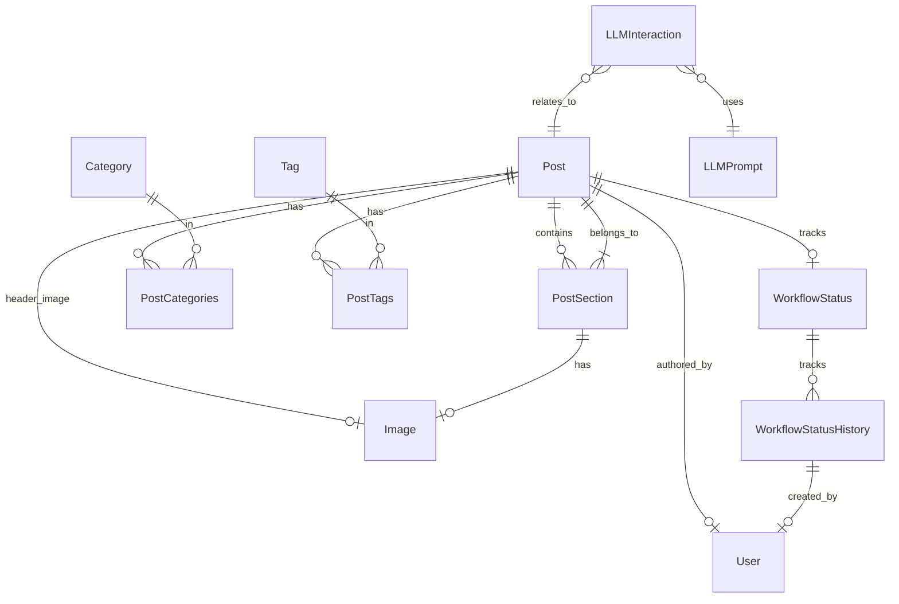

# Database Documentation

## Overview
The blog uses SQLAlchemy with PostgreSQL for data storage. The schema is designed around content reusability, workflow management, and multi-platform content optimization.

## Core Models

### Content Models
1. **[Post](post.md)**
   - Main container for blog content
   - Workflow and publishing status
   - SEO and LLM metadata
   - Syndication tracking

2. **[Section](section.md)**
   - Reusable content blocks
   - Multi-platform content versions
   - Media attachments
   - Position management

3. **[Image](media.md)**
   - Media asset management
   - Watermarking support
   - AI generation metadata
   - Technical metadata (EXIF)

### Organization Models
1. **Category**
   - Hierarchical categories
   - Slug-based URLs
   - Optional descriptions
   - Parent-child relationships

2. **Tag**
   - Flat taxonomy
   - Slug-based URLs
   - Optional descriptions

### Workflow Models
1. **WorkflowStatus**
   - Current stage tracking
   - Stage-specific data
   - History tracking
   - Stage validation

2. **WorkflowStatusHistory**
   - Stage transitions
   - User attribution
   - Timestamp tracking
   - Transition notes

### LLM Integration Models
1. **LLMPrompt**
   - Named prompt templates
   - Parameter definitions
   - Versioning support

2. **LLMInteraction**
   - Prompt/response tracking
   - Token usage monitoring
   - Performance metrics

## Entity Relationships



## Key Features

### Content Management
- Hierarchical content structure (Post > Section)
- Flexible content types (text, image, video, audio)
- Position-based ordering
- Rich metadata support

### Media Handling
- Centralized media library
- Watermarking support
- AI image generation integration
- Metadata preservation

### Workflow System
- Stage-based workflow
  - Conceptualization
  - Authoring
  - Metadata
  - Images
  - Validation
  - Publishing
  - Syndication
- History tracking
- User attribution

### LLM Integration
- Prompt template management
- Interaction tracking
- Performance monitoring
- Token usage tracking

## Common Queries

### Post Management
```sql
-- Get post with sections
SELECT p.*, s.* 
FROM post p 
LEFT JOIN post_section s ON p.id = s.post_id 
WHERE p.slug = :slug 
ORDER BY s.position;

-- Get post categories
SELECT c.* 
FROM category c 
JOIN post_categories pc ON c.id = pc.category_id 
WHERE pc.post_id = :post_id;

-- Get workflow history
SELECT h.* 
FROM workflow_status_history h 
JOIN workflow_status w ON h.workflow_status_id = w.id 
WHERE w.post_id = :post_id 
ORDER BY h.created_at DESC;
```

### Content Organization
```sql
-- Get category tree
WITH RECURSIVE category_tree AS (
    SELECT id, name, parent_id, 0 as level
    FROM category
    WHERE parent_id IS NULL
    UNION ALL
    SELECT c.id, c.name, c.parent_id, ct.level + 1
    FROM category c
    JOIN category_tree ct ON c.parent_id = ct.id
)
SELECT * FROM category_tree;
```

## Best Practices

### Data Integrity
1. Use transactions for multi-table updates
2. Maintain referential integrity
3. Handle soft deletes appropriately
4. Validate workflow transitions

### Performance
1. Use appropriate indexes
2. Optimize JSON queries
3. Implement caching
4. Monitor query performance

### Content Management
1. Validate content types
2. Maintain position ordering
3. Handle media references
4. Track content changes

See individual model documentation for detailed field descriptions and usage examples. 