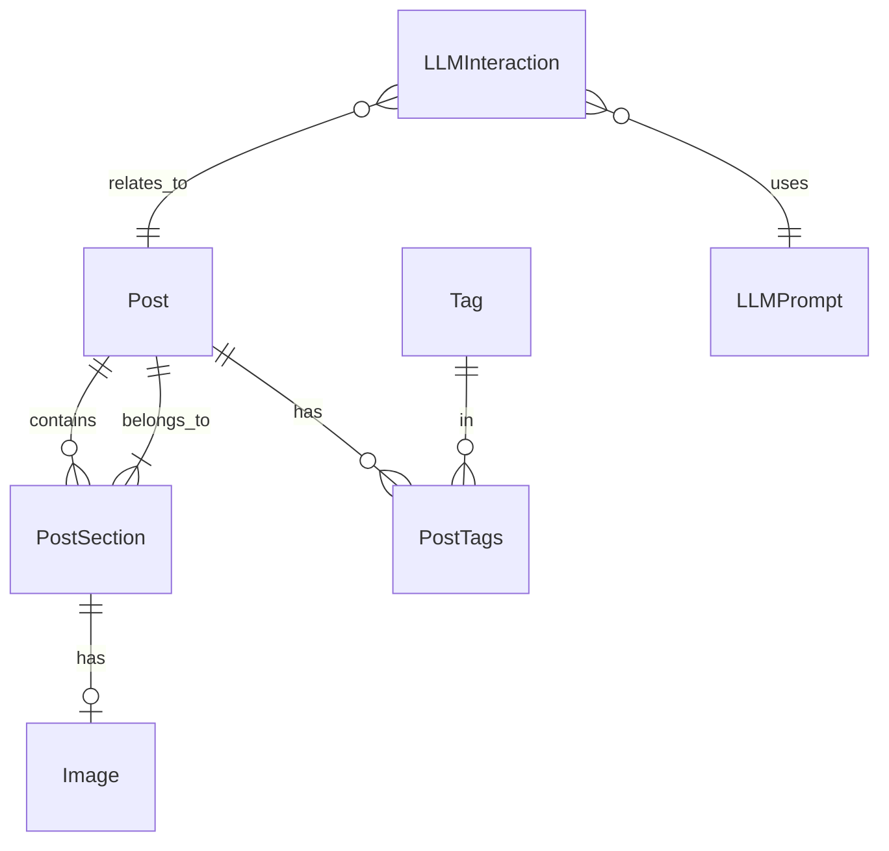

# Database Documentation

## Overview
The blog uses PostgreSQL with SQLAlchemy ORM for data storage in all environments. The schema is designed around content management, LLM integration, and media handling.

## Core Models

### Content Models
1. **[Post](post.md)**
   - Title and subtitle
   - Slug-based URLs
   - Content and summary
   - Publishing status
   - LLM metadata
   - Created/updated timestamps

2. **[Section](section.md)**
   - Title and subtitle
   - Content with position
   - Content type (text, image, video, audio)
   - Media attachments
   - Keywords and social snippets
   - Section metadata
   - Created/updated timestamps

3. **[Image](media.md)**
   - Original and system filenames
   - File path management
   - Alt text and captions
   - Image prompts and notes
   - Watermarking support
   - Image metadata
   - Created/updated timestamps

### Organization Models
1. **Tag**
   - Name and slug
   - Many-to-many with posts

### LLM Integration Models
1. **LLMPrompt**
   - Name and description
   - Prompt template
   - Parameters (JSON)
   - Created/updated timestamps

2. **LLMInteraction**
   - Link to prompt and post
   - Input and output text
   - Model information
   - Parameters (JSON)
   - Token usage and duration
   - Created timestamp

## Entity Relationships



## Table Schemas

### Post
```sql
CREATE TABLE post (
    id INTEGER PRIMARY KEY,
    title VARCHAR(200) NOT NULL,
    subtitle VARCHAR(200),
    slug VARCHAR(200) NOT NULL UNIQUE,
    content TEXT NOT NULL,
    summary VARCHAR(500),
    published BOOLEAN,
    created_at DATETIME,
    updated_at DATETIME,
    llm_metadata JSON
);
```

### PostSection
```sql
CREATE TABLE post_section (
    id INTEGER PRIMARY KEY,
    post_id INTEGER NOT NULL REFERENCES post(id) ON DELETE CASCADE,
    title VARCHAR(200),
    subtitle VARCHAR(200),
    content TEXT NOT NULL,
    position INTEGER NOT NULL,
    image_id INTEGER REFERENCES image(id) ON DELETE SET NULL,
    video_url VARCHAR(500),
    audio_url VARCHAR(500),
    content_type VARCHAR(50) NOT NULL DEFAULT 'text',
    duration INTEGER,
    keywords JSON,
    social_media_snippets JSON,
    section_metadata JSON,
    created_at DATETIME NOT NULL DEFAULT CURRENT_TIMESTAMP,
    updated_at DATETIME NOT NULL DEFAULT CURRENT_TIMESTAMP,
    UNIQUE(post_id, position)
);
```

### Image
```sql
CREATE TABLE image (
    id INTEGER PRIMARY KEY,
    filename VARCHAR(255) NOT NULL,
    original_filename VARCHAR(255) NOT NULL,
    path VARCHAR(500) NOT NULL,
    alt_text VARCHAR(500),
    caption TEXT,
    image_prompt TEXT,
    notes TEXT,
    image_metadata JSON,
    watermarked BOOLEAN DEFAULT FALSE,
    watermarked_path VARCHAR(500),
    created_at DATETIME,
    updated_at DATETIME
);
```

### Tag and PostTags
```sql
CREATE TABLE tag (
    id INTEGER PRIMARY KEY,
    name VARCHAR(50) NOT NULL UNIQUE,
    slug VARCHAR(50) NOT NULL UNIQUE
);

CREATE TABLE post_tags (
    post_id INTEGER NOT NULL REFERENCES post(id),
    tag_id INTEGER NOT NULL REFERENCES tag(id),
    PRIMARY KEY (post_id, tag_id)
);
```

### LLM Tables
```sql
CREATE TABLE llm_prompt (
    id INTEGER PRIMARY KEY,
    name VARCHAR(100) NOT NULL,
    description TEXT,
    prompt_template TEXT NOT NULL,
    parameters JSON,
    created_at DATETIME,
    updated_at DATETIME
);

CREATE TABLE llm_interaction (
    id INTEGER PRIMARY KEY,
    prompt_id INTEGER REFERENCES llm_prompt(id),
    post_id INTEGER REFERENCES post(id),
    input_text TEXT NOT NULL,
    output_text TEXT NOT NULL,
    model_used VARCHAR(50) NOT NULL,
    parameters JSON,
    tokens_used INTEGER,
    duration FLOAT,
    created_at DATETIME
);
```

## LLM Operation Logging

The database includes tables for tracking LLM operations and errors:

### llm_log Table
- Stores detailed logs of all LLM operations
- Includes request parameters, response data, and timing information
- Tracks model versions and configurations used
- Records error details and stack traces

### Error Tracking
- Error classification and categorization
- Timestamp and duration tracking
- Related request context
- Recovery actions taken

### Performance Metrics
- Response time tracking
- Success/failure rates
- Resource utilization
- Model performance statistics

### Data Retention
- Log rotation policies
- Archival procedures
- Cleanup of old records
- Backup requirements

## Best Practices

### Data Integrity
1. Use transactions for multi-table updates
2. Maintain referential integrity
3. Handle soft deletes appropriately
4. Validate content types

### Performance
1. Use appropriate indexes
   - `post_section_position` (post_id, position)
   - `post_section_content_type` (content_type)
   - `post_section_created` (created_at)
2. Optimize JSON queries
3. Implement caching
4. Monitor query performance

### Content Management
1. Validate content types
2. Maintain position ordering
3. Handle media references
4. Track content changes

### Database Operations
All database operations should be performed using:
1. Flask CLI commands for common operations
2. Direct database access for advanced operations
3. Migration scripts for schema changes

Note: When rendering workflow sub-stages in the frontend, always use the actual stage_data from the backend for each post and sub-stage, not just the static workflow definition. The web interface for database management has been removed. Use the command line tools or direct database access instead.

See individual model documentation for detailed field descriptions and usage examples.

## Automated PostgreSQL Backups

A backup script (`scripts/pg_backup.sh`) creates a timestamped SQL backup of your `blog` PostgreSQL database every hour. Backups are stored in `~/.blog_pg_backups` and are automatically deleted after 14 days.

### How it works
- The script uses `pg_dump` to export the database.
- A cron job runs the script at the top of every hour.
- Old backups (older than 14 days) are deleted automatically.

### Manual Backup
You can run the script manually:
```sh
./scripts/pg_backup.sh
```

### Restore Example
To restore from a backup:
```sh
psql -U postgres -d blog < ~/.blog_pg_backups/blog_backup_YYYYMMDD_HHMMSS.sql
```

### Adjusting Frequency or Retention
- Edit your crontab (`crontab -e`) to change the schedule.
- Edit the script to change the retention period. 