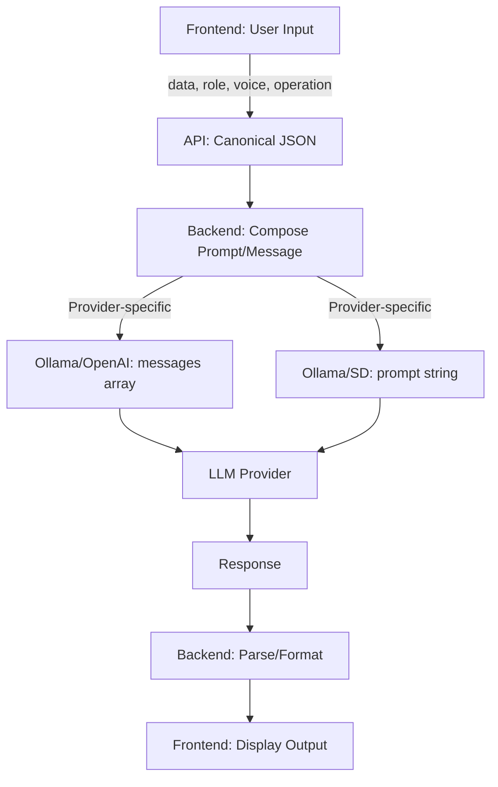
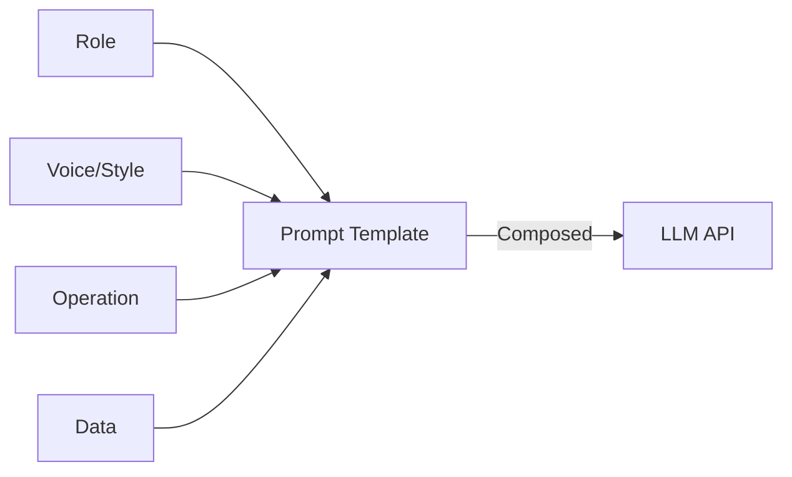

# LLM Prompt Structuring: Data Flow Diagram

> **Note:** LLMs do not interpret custom JSON keys (like "voice" or "style") unless you explicitly include them in the prompt or message content. The backend must compose all elements into the prompt string or message array as required by the LLM API.

---

# LLM Prompt Composition Diagram

