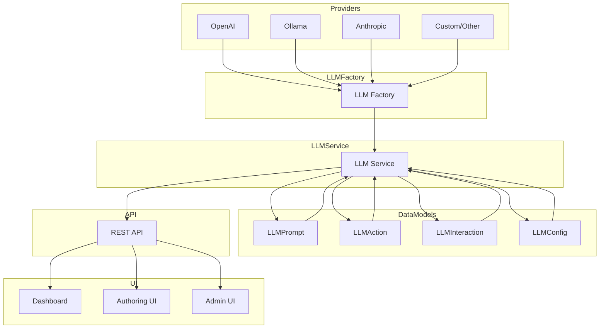

# LLM Framework Stack Diagram

This document provides a visual and written overview of the LLM framework architecture for BlogForge, including how LLMs are integrated, extended, and used throughout the system.

---

## LLM Stack Overview

BlogForge's LLM stack is designed for flexibility, extensibility, and robust content automation. It supports multiple providers (OpenAI, Ollama, Anthropic, etc.), prompt templating, action orchestration, and full auditability.

### **Key Components**
- **Providers:** Pluggable backends (OpenAI, Ollama, etc.)
- **LLM Factory:** Central registry and instantiation for providers
- **LLM Service:** Unified interface for generating text, metadata, and executing actions
- **Prompt Management:** Database-driven prompt templates, versioned and reusable
- **LLM Actions:** Orchestrated tasks (summarize, tag, SEO, etc.)
- **LLM Interactions:** Full logging of all LLM calls and results
- **API Layer:** REST endpoints for config, invocation, and management
- **UI Integration:** Authoring, review, and admin interfaces

---

## Mermaid Diagram

---

## How It Works

1. **Provider Abstraction:**
   - All LLM providers inherit from a common interface (`LLMProvider`).
   - Providers are registered with the `LLMFactory` for dynamic instantiation.
   - Example: Add a new provider by subclassing `LLMProvider` and registering it.

2. **LLM Factory:**
   - Central registry for all providers.
   - Handles instantiation and caching of provider instances.
   - Used by the `LLMService` to obtain the correct backend.

3. **LLM Service:**
   - Main entry point for all LLM operations (text generation, metadata, actions).
   - Handles prompt templating, context injection, and provider selection.
   - Logs all interactions for audit and debugging.

4. **Prompt & Action Management:**
   - Prompts and actions are stored in the database (`LLMPrompt`, `LLMAction`).
   - Prompts are versioned and reusable; actions can be chained or parameterized.
   - All LLM calls are logged as `LLMInteraction` records.

5. **API & UI Integration:**
   - REST API exposes LLM config, invocation, and management endpoints.
   - UI surfaces (dashboard, authoring, admin) allow users to trigger LLM actions, review results, and manage prompts.

---

## Extending the Stack

- **Add a Provider:**
  - Implement a new `LLMProvider` subclass.
  - Register it in the `LLMFactory`.
  - Add config options as needed.

- **Add a Prompt/Action:**
  - Create a new prompt template in the database.
  - Define a new `LLMAction` for custom workflows.

- **Audit & Debug:**
  - All LLM calls and results are logged in `LLMInteraction`.
  - Use the admin UI or API to review history and troubleshoot.

---

## References & Further Reading
- [LLM Reference Stack README](./README.md)
- [LLM Resources Index](./llm_resources.md)
- [LLM Integration Guide](../project/llm_architecture.md)
- [Hybrid LLM Framework Refactor Plan](../temp/llm_framework_hybrid_refactor.md)

---

*Update this diagram and section as the LLM stack evolves. For questions or contributions, see the README and implementation plan.* 