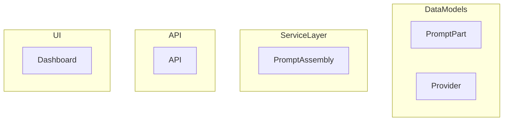

# LLM Framework Stack Diagram

This document provides a visual and written overview of the LLM framework architecture for BlogForge.

---

## Mermaid Diagram

---

## Component Overview

- **Data Models:**
  - `LLMPromptPart`: Modular parts of prompts (system, user, style, etc.)
  - `LLMProvider`/`LLMModel`: Registry of available providers/models
  - `LLMMessage`: Message-based prompt structure
  - `LLMTask`: Tracks LLM executions and results
- **Service Layer:**
  - Prompt assembly, provider/model adapters, and task runner logic
- **API:**
  - RESTful endpoints for managing providers, models, prompts, tasks, and results
- **UI:**
  - Dashboard for LLM management
  - Prompt assembly and preview
  - Task runner and results
  - Workflow integration (e.g., "Automate with LLM" in workflow stages)

---

## Updating This Diagram
- Update the Mermaid diagram and this doc as the stack evolves.
- Add PNGs or screenshots for more complex flows if needed.
- Reference this doc from the [README](./README.md) and implementation plan. 