# Workflow API Endpoints Reference

## Overview

This document provides a reference for workflow-specific API endpoints. For comprehensive API documentation including detailed examples, error handling, and testing information, see the main API reference:

**[📚 Complete API Reference](../api/current/README.md)**

## Data Flow Architecture

### Workflow LLM Action Processing Flow


### LLM Settings Integration


### Universal Input Mapping System

```mermaid
graph LR
    A[LLM Action Input] --> B[Field Mapping UI]
    B --> C[Select Table]
    C --> D[post_development]
    C --> E[post_section]
    C --> F[Future Tables]
    
    B --> G[Select Field]
    G --> H[title]
    G --> I[description]
    G --> J[content]
    
    K[Backend Processing] --> L[Fetch from Specified Table]
    L --> M[Use Current Section/Post Context]
    M --> N[Insert into Prompt Template]
```



## Quick Reference

### Core API Documentation

- **[LLM Integration](../api/current/llm.md)** - LLM provider management, model access, and action execution
- **[Post Management](../api/current/posts.md)** - Post development, structure planning, and content management  
- **[Field Mapping](../api/current/fields.md)** - Database field relationships and UI component mapping
- **[Format Templates](../api/current/formats.md)** - Structured data format definitions and validation

### Workflow-Specific Endpoints

The following endpoints are specifically designed for workflow operations:

#### Execute LLM Workflow Step
```http
POST /api/workflow/posts/{post_id}/{stage}/{substage}/llm
```

**Example:**
```bash
curl -X POST "http://localhost:5000/api/workflow/posts/21/planning/idea/llm" \
  -H "Content-Type: application/json" \
  -d '{"step": "initial_concept"}'
```

#### Execute Writing Stage LLM Action
```http
POST /api/workflow/posts/{post_id}/writing/content/writing_llm
```

**Request Payload:**
```json
{
  "section_ids": [1, 2, 3],
  "llm_action_id": 5,
  "inputs": {
    "title": "Section Title",
    "description": "Section Description"
  },
  "llm_settings": {
    "model": "gpt-4",
    "temperature": 0.7,
    "timeout": 30,
    "max_tokens": 1000
  }
}
```

**Response Structure:**
```json
{
  "success": true,
  "results": [
    {
      "section_id": 1,
      "output": "Generated content for section 1",
      "parameters": {
        "model": "gpt-4",
        "temperature": 0.7,
        "tokens_used": 150
      }
    },
    {
      "section_id": 2,
      "output": "Generated content for section 2",
      "parameters": {
        "model": "gpt-4",
        "temperature": 0.7,
        "tokens_used": 200
      }
    }
  ],
  "step": "rewrite_section",
  "sections_processed": [1, 2, 3]
}
```

#### Get Workflow Steps
```http
GET /api/workflow/steps
```

#### Get Step by ID
```http
GET /api/workflow/steps/{step_id}
```

#### Update Step Configuration
```http
PUT /api/workflow/steps/{step_id}
```

## LLM Settings and Configuration

### Settings Integration
- **LLM Settings Panel**: Purple panel on workflow pages contains model selection, temperature, timeout, and other parameters
- **Per-Request Application**: Settings are applied to each individual LLM call, not the entire batch
- **Timeout Handling**: Each section processed gets its own timeout window
- **Model Flexibility**: Different actions can use different models based on settings

### Response Standardization
All LLM action endpoints return a consistent response structure:
- `success`: Boolean indicating overall success
- `results`: Array of results for each processed section
- `parameters`: Metadata about the LLM call (model, tokens, etc.)
- `step`: The workflow step that was executed
- `sections_processed`: Array of section IDs that were processed

## Universal Input Mapping

### Table Selection
- **Current Limitation**: Input mappings are hardcoded to specific tables
- **Future Enhancement**: Allow dynamic table selection for inputs/outputs
- **Supported Tables**: 
  - `post_development` (post-level data)
  - `post_section` (section-level data)
  - Future tables as needed

### Field Mapping UI
- **Location**: `/settings/workflow_field_mapping`
- **Functionality**: Configure which tables and fields are available for LLM Actions
- **Context Awareness**: Automatically uses current section/post context when fetching data

## Workflow Integration

The workflow system integrates with all core API endpoints:

- **Field Management**: Use field mapping endpoints to configure workflow step inputs/outputs
- **LLM Processing**: Execute LLM actions within workflow context
- **Post Development**: Update post data as workflow progresses
- **Format System**: Apply structured formats to workflow outputs

## Testing

For comprehensive testing examples and error handling, refer to the individual API documentation files listed above.

## Related Documentation

- [Workflow System Overview](README.md)
- [LLM Panel Integration](llm_panel.md)
- [Format System](formats.md)
- [Database Schema](../database/schema.md)

---

**Note**: This document provides a quick reference for workflow-specific endpoints. For complete API documentation with detailed examples, error codes, and testing information, please refer to the main API reference documentation. 