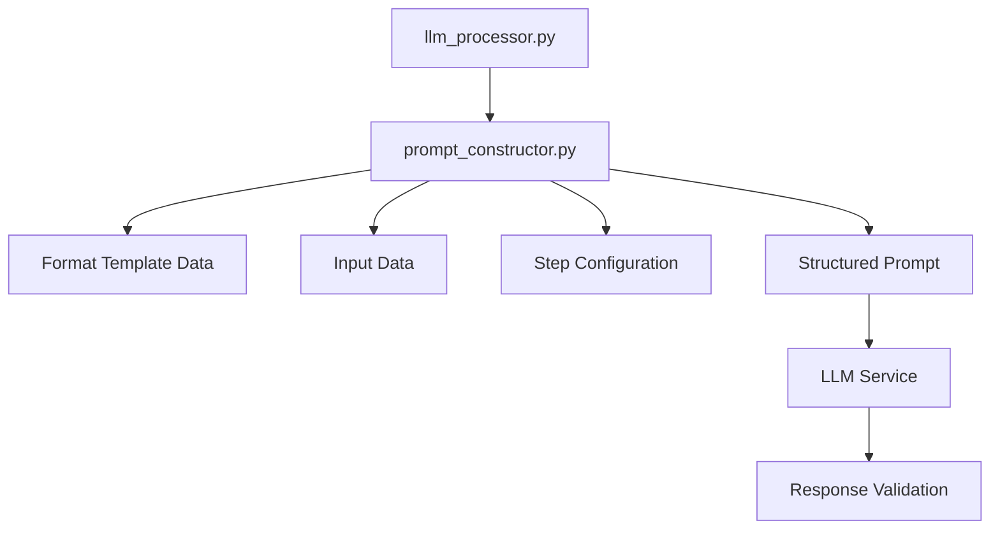

# Format Template System Status & Implementation Plan

## Current Status (June 30, 2025)

### ✅ **Completed Work**

#### 1. Database Cleanup
- **Removed all post-specific `workflow_step_format` rows** from database
- **Confirmed step-level format configuration** is working correctly
- **Verified format templates are properly stored** in `workflow_step_entity.default_input_format_id` and `default_output_format_id`

#### 2. Backend Updates
- **Updated `llm_processor.py`** to fetch format configuration from step-level only
- **Modified format template fetching** to use `workflow_step_entity` table instead of post-specific table
- **Confirmed frontend only calls step-level endpoint** (`/api/workflow/steps/{stepId}/formats`)

#### 3. Log Structure Cleanup
- **Eliminated all duplication** in `workflow_diagnostic_db_fields.json`
- **Format templates appear once** at top level with complete data
- **Clean, unified JSON structure** with no redundant sections
- **Complete format template data** including schema, LLM instructions, descriptions

#### 4. Current Log Structure
```json
{
  "metadata": { ... },
  "input_format_template": {
    "id": 39,
    "name": "Plain text (GB) - Input",
    "description": "A plain text input using UK English spellings and idioms.",
    "fields": { "type": "input", "schema": { ... } },
    "llm_instructions": "The input will be provided as plain text...",
    "created_at": "...",
    "updated_at": "..."
  },
  "output_format_template": { ... },
  "database_fields": {
    "post_info": { ... },
    "post_development": { ... },
    "workflow_config": { ... },
    "format_config": { ... }
  }
}
```

### 🔄 **Current LLM Message Issue**

#### Current Prompt Structure:
```
You are an expert in Scottish history and culture...

Generate five alternative, arresting, and informative blog post titles for a post based on the following expanded idea. Return your response as a strict JSON array of strings, with no commentary or formatting—just the list of titles.

Expanded Idea:
["Spinning Yarns: The Ancient Art of Scottish Storytelling", ...]

input1: Story-telling
```

#### Desired Prompt Structure:
```
CONTEXT:
You are an expert in Scottish history and culture...

The input will be provided as plain text, using only UK English spellings and idioms. Do not expect any JSON structure other than a single string field named text.

TASK:
Generate five alternative, arresting, and informative blog post titles for a post based on the following Input. Return your response as a strict JSON array of strings, with no commentary or formatting—just the list of titles.

Input1:
Story-telling

RESPONSE:
Return your response as a JSON object with title and description fields. Ensure both fields are present and contain appropriate content.
```

---

## Implementation Plan: External Prompt Constructor

### **Phase 1: Create External Prompt Constructor Script**

#### 1.1 File Structure
```
app/workflow/scripts/
├── llm_processor.py          # Current script (will be updated)
├── prompt_constructor.py     # New external script
└── prompt_utils.py          # Shared utilities (if needed)
```

#### 1.2 Core Functions in `prompt_constructor.py`

##### **Main Function: `build_structured_prompt()`**
```python
def build_structured_prompt(
    system_prompt: str,
    task_prompt: str,
    input_format_template: Dict[str, Any],
    output_format_template: Dict[str, Any],
    input_data: Dict[str, Any],
    step_config: Dict[str, Any]
) -> Dict[str, Any]:
    """
    Build a structured prompt with CONTEXT, TASK, and RESPONSE sections.
    
    Returns:
        {
            "prompt": str,           # Complete structured prompt
            "validation": Dict,      # Validation status and errors
            "metadata": Dict         # Prompt metadata for logging
        }
    """
```

##### **Format Template Extraction: `extract_format_instructions()`**
```python
def extract_format_instructions(
    format_template: Dict[str, Any],
    format_type: str  # "input" or "output"
) -> Dict[str, str]:
    """
    Extract LLM instructions and description from format template.
    
    Returns:
        {
            "llm_instructions": str,
            "description": str,
            "schema_summary": str
        }
    """
```

##### **Input Field Mapping: `map_input_fields()`**
```python
def map_input_fields(
    input_data: Dict[str, Any],
    step_config: Dict[str, Any],
    input_format_template: Dict[str, Any]
) -> Dict[str, Any]:
    """
    Map input data according to step configuration and format template.
    
    Handles:
    - Field name mapping (e.g., idea_seed -> Input1)
    - Data transformation based on format template
    - Validation of input data structure
    """
```

##### **Prompt Section Building: `build_prompt_sections()`**
```python
def build_prompt_sections(
    context_data: Dict[str, str],
    task_data: Dict[str, str],
    response_data: Dict[str, str]
) -> str:
    """
    Build individual prompt sections with proper formatting.
    
    Returns formatted string with CONTEXT:, TASK:, RESPONSE: sections.
    """
```

##### **Validation: `validate_prompt_data()`**
```python
def validate_prompt_data(
    system_prompt: str,
    task_prompt: str,
    input_format_template: Dict[str, Any],
    output_format_template: Dict[str, Any],
    input_data: Dict[str, Any]
) -> Dict[str, Any]:
    """
    Validate all required data is present and properly formatted.
    
    Returns:
        {
            "valid": bool,
            "errors": List[str],
            "warnings": List[str]
        }
    """
```

#### 1.3 Prompt Structure Implementation

##### **CONTEXT Section**
```python
def build_context_section(
    system_prompt: str,
    input_format_instructions: Dict[str, str]
) -> str:
    """
    Build CONTEXT section with system prompt and input format instructions.
    
    Format:
    CONTEXT:
    [system_prompt]
    
    [input_format_instructions.llm_instructions]
    [input_format_instructions.description]
    """
```

##### **TASK Section**
```python
def build_task_section(
    task_prompt: str,
    input_data: Dict[str, Any],
    input_mapping: Dict[str, str]
) -> str:
    """
    Build TASK section with task prompt and mapped input data.
    
    Format:
    TASK:
    [task_prompt]
    
    [mapped_input_data]
    """
```

##### **RESPONSE Section**
```python
def build_response_section(
    output_format_instructions: Dict[str, str]
) -> str:
    """
    Build RESPONSE section with output format instructions.
    
    Format:
    RESPONSE:
    [output_format_instructions.llm_instructions]
    [output_format_instructions.description]
    """
```

### **Phase 2: Integration with Existing System**

#### 2.1 Update `llm_processor.py`

##### **Import External Constructor**
```python
from .prompt_constructor import build_structured_prompt, validate_prompt_data
```

##### **Replace Current Prompt Construction**
```python
# Current approach (to be replaced):
def construct_prompt(system_prompt, task_prompt, inputs, config):
    # ... current implementation

# New approach:
def process_step_with_external_prompt(post_id, stage, substage, step, config):
    # ... existing setup code ...
    
    # Build structured prompt using external constructor
    prompt_result = build_structured_prompt(
        system_prompt=config.get('system_prompt'),
        task_prompt=config.get('task_prompt'),
        input_format_template=input_format_template,
        output_format_template=output_format_template,
        input_data=inputs,
        step_config=config
    )
    
    if not prompt_result['validation']['valid']:
        raise ValueError(f"Prompt validation failed: {prompt_result['validation']['errors']}")
    
    # Use structured prompt for LLM call
    llm_message = prompt_result['prompt']
    # ... rest of processing
```

#### 2.2 Error Handling and Logging

##### **Enhanced Error Handling**
```python
def handle_prompt_construction_errors(prompt_result: Dict[str, Any]) -> None:
    """
    Handle prompt construction errors with detailed logging.
    """
    if not prompt_result['validation']['valid']:
        error_msg = f"Prompt construction failed: {prompt_result['validation']['errors']}"
        logger.error(error_msg)
        # Log detailed validation information
        log_validation_details(prompt_result['validation'])
        raise PromptConstructionError(error_msg)
```

##### **Enhanced Logging**
```python
def log_prompt_construction_metadata(prompt_result: Dict[str, Any]) -> None:
    """
    Log prompt construction metadata for debugging.
    """
    metadata = prompt_result.get('metadata', {})
    logger.info(f"Prompt constructed successfully: {metadata}")
    
    # Log prompt structure statistics
    log_prompt_structure_stats(prompt_result['prompt'])
```

### **Phase 3: Testing and Validation**

#### 3.1 Unit Tests for Prompt Constructor

##### **Test File: `tests/test_prompt_constructor.py`**

```python
def test_build_structured_prompt():
    """Test complete prompt construction with real data."""
    
def test_extract_format_instructions():
    """Test format template instruction extraction."""
    
def test_map_input_fields():
    """Test input field mapping and transformation."""
    
def test_validate_prompt_data():
    """Test prompt data validation."""
    
def test_prompt_section_building():
    """Test individual section building."""
    
def test_error_handling():
    """Test error handling for invalid data."""
```

#### 3.2 Integration Tests

##### **Test File: `tests/test_prompt_integration.py`**

```python
def test_prompt_constructor_integration():
    """Test prompt constructor integration with llm_processor."""
    
def test_format_template_integration():
    """Test format template integration in prompts."""
    
def test_input_field_mapping_integration():
    """Test input field mapping integration."""
    
def test_llm_response_validation():
    """Test LLM response validation against output format."""
```

#### 3.3 Manual Testing

##### **Test Cases**
1. **Basic Prompt Construction**
   - Test with simple format templates
   - Verify CONTEXT, TASK, RESPONSE structure
   - Check format template integration

2. **Complex Format Templates**
   - Test with complex JSON schema
   - Verify LLM instructions extraction
   - Check schema summary generation

3. **Input Field Mapping**
   - Test with various input field types
   - Verify correct field mapping
   - Check data transformation

4. **Error Scenarios**
   - Test with missing format templates
   - Test with invalid input data
   - Test with malformed step configuration

### **Phase 4: Documentation and Deployment**

#### 4.1 Documentation Updates

##### **Update Existing Docs**
- `docs/workflow/formats.md` - Add prompt constructor documentation
- `docs/workflow/README.md` - Update architecture section
- `docs/CHANGES.log` - Document implementation

##### **Create New Docs**
- `docs/workflow/prompt_constructor.md` - Complete prompt constructor guide
- `docs/workflow/prompt_examples.md` - Example prompts and usage

#### 4.2 Deployment Strategy

##### **Staged Rollout**
1. **Development Testing**
   - Implement in development environment
   - Run comprehensive test suite
   - Validate with real workflow steps

2. **Staging Validation**
   - Deploy to staging environment
   - Test with production-like data
   - Validate prompt quality and LLM responses

3. **Production Deployment**
   - Deploy with feature flag
   - Monitor prompt construction and LLM responses
   - Rollback plan if issues arise

### **Phase 5: Advanced Features (Future)**

#### 5.1 Prompt Template Management

##### **Dynamic Prompt Templates**
```python
def load_prompt_template(template_id: int) -> Dict[str, Any]:
    """Load prompt template from database."""
    
def save_prompt_template(template_data: Dict[str, Any]) -> int:
    """Save prompt template to database."""
```

#### 5.2 Prompt Versioning

##### **Version Control**
```python
def version_prompt_template(template_id: int, version_notes: str) -> int:
    """Create new version of prompt template."""
    
def get_prompt_template_version(template_id: int, version: str) -> Dict[str, Any]:
    """Get specific version of prompt template."""
```

#### 5.3 Prompt Analytics

##### **Usage Tracking**
```python
def track_prompt_usage(prompt_metadata: Dict[str, Any]) -> None:
    """Track prompt usage for analytics."""
    
def get_prompt_analytics(template_id: int) -> Dict[str, Any]:
    """Get analytics for prompt template."""
```

---

## Detailed Implementation Discussion

### **Architecture Decisions**

#### **1. External Script vs. Module Integration**

**Option A: External Script (`prompt_constructor.py`)**
- **Pros:** Clear separation of concerns, easier testing, independent versioning
- **Cons:** Additional file complexity, potential import issues
- **Decision:** External script for better maintainability and testing

**Option B: Module Integration (within `llm_processor.py`)**
- **Pros:** Simpler file structure, no import complexity
- **Cons:** Mixed concerns, harder to test, less maintainable
- **Decision:** Rejected in favor of external script

#### **2. Data Flow Architecture**



#### **3. Error Handling Strategy**

**Hierarchical Error Handling:**
1. **Data Validation Errors:** Invalid format templates, missing data
2. **Construction Errors:** Template parsing, string formatting issues
3. **Integration Errors:** Import issues, function call failures
4. **Runtime Errors:** Memory issues, performance problems

### **Detailed Technical Specifications**

#### **1. Format Template Data Structure**

**Input Format Template:**
```python
{
    "id": 27,
    "name": "Title-description JSON (Input)",
    "description": "Structured JSON with two elements: title (string) and description (string).",
    "fields": {
        "type": "input",
        "schema": {
            "type": "object",
            "required": ["title", "description"],
            "properties": {
                "title": {"type": "string", "description": "The main title"},
                "description": {"type": "string", "description": "A description of the title"}
            }
        }
    },
    "llm_instructions": "The input will be provided as a JSON object with title and description fields. Process this input according to the specified schema requirements.",
    "created_at": "2025-06-29 10:23:51.020087",
    "updated_at": "2025-06-30 11:31:07.802536"
}
```

**Output Format Template:**
```python
{
    "id": 38,
    "name": "Plain text (GB) - Output",
    "description": "Plain text output using UK English spellings and idioms.",
    "fields": {
        "type": "output",
        "schema": {
            "type": "string",
            "description": "Plain text response"
        }
    },
    "llm_instructions": "Return your response as plain text using UK English spellings and idioms. Do not include any JSON formatting or special characters.",
    "created_at": "2025-06-29 10:23:51.020087",
    "updated_at": "2025-06-30 11:31:07.802536"
}
```

#### **2. Prompt Construction Algorithm**

**Step 1: Data Validation**
```python
def validate_input_data(data: Dict[str, Any]) -> ValidationResult:
    """
    Validate all input data before prompt construction.
    
    Checks:
    - Required fields present
    - Data types correct
    - Format templates valid
    - Step configuration complete
    """
```

**Step 2: Format Template Processing**
```python
def process_format_templates(
    input_template: Dict[str, Any],
    output_template: Dict[str, Any]
) -> ProcessedTemplates:
    """
    Extract and process format template data.
    
    Returns:
    - Input instructions and schema
    - Output instructions and schema
    - Validation status
    """
```

**Step 3: Input Field Mapping**
```python
def map_input_fields(
    raw_input: Dict[str, Any],
    step_config: Dict[str, Any],
    input_template: Dict[str, Any]
) -> MappedInput:
    """
    Map input fields according to step configuration.
    
    Handles:
    - Field name transformation
    - Data type conversion
    - Schema validation
    """
```

**Step 4: Prompt Assembly**
```python
def assemble_prompt(
    context_data: ContextData,
    task_data: TaskData,
    response_data: ResponseData
) -> str:
    """
    Assemble final prompt with proper formatting.
    
    Ensures:
    - Correct section headers
    - Proper spacing
    - Clear structure
    """
```

#### **3. Input Field Mapping Logic**

**Current Mapping Issues:**
- Uses "expanded idea" field instead of actual input field
- No field name transformation
- No data type validation

**Proposed Mapping Logic:**
```python
def transform_input_field(
    field_name: str,
    field_value: Any,
    step_config: Dict[str, Any]
) -> Tuple[str, Any]:
    """
    Transform input field name and value.
    
    Examples:
    - idea_seed -> Input1
    - title -> Input1
    - description -> Input2
    
    Returns: (transformed_name, transformed_value)
    """
```

**Field Name Mapping Rules:**
1. **Primary Field:** Always maps to "Input1"
2. **Secondary Fields:** Map to "Input2", "Input3", etc.
3. **Array Fields:** Expand into multiple inputs
4. **Object Fields:** Flatten into individual inputs

#### **4. Prompt Section Templates**

**CONTEXT Section Template:**
```
CONTEXT:
{system_prompt}

{input_format_instructions}

{input_format_description}
```

**TASK Section Template:**
```
TASK:
{task_prompt}

{input_data_section}
```

**RESPONSE Section Template:**
```
RESPONSE:
{output_format_instructions}

{output_format_description}
```

### **Implementation Considerations**

#### **1. Performance Optimization**

**String Concatenation Strategy:**
```python
# Efficient string building
def build_prompt_efficiently(sections: List[str]) -> str:
    """Use join() for efficient string concatenation."""
    return "\n\n".join(sections)
```

**Memory Management:**
```python
# Memory-efficient processing
def process_large_format_templates(template: Dict[str, Any]) -> Dict[str, Any]:
    """Process large format templates without memory issues."""
    # Use generators for large data
    # Stream processing for large prompts
```

#### **2. Error Recovery**

**Graceful Degradation:**
```python
def handle_missing_format_template(
    template_type: str,
    step_config: Dict[str, Any]
) -> Dict[str, Any]:
    """
    Handle missing format templates gracefully.
    
    Returns default template or raises appropriate error.
    """
```

**Partial Prompt Construction:**
```python
def build_partial_prompt(
    available_data: Dict[str, Any]
) -> str:
    """
    Build prompt with available data only.
    
    Skips missing sections and logs warnings.
    """
```

#### **3. Testing Strategy**

**Unit Test Coverage:**
- Format template extraction: 100%
- Input field mapping: 100%
- Prompt section building: 100%
- Error handling: 100%

**Integration Test Scenarios:**
- Complete workflow step processing
- Format template integration
- Error scenario handling
- Performance testing

**Manual Test Cases:**
- Real workflow steps with actual data
- Edge cases and error conditions
- Performance with large prompts
- User acceptance testing

### **Alternative Implementation Approaches**

#### **1. Template-Based Approach**

**Using Jinja2 Templates:**
```python
def build_prompt_with_templates(
    template_data: Dict[str, Any]
) -> str:
    """
    Use Jinja2 templates for prompt construction.
    
    Pros: Flexible, maintainable
    Cons: Additional dependency, complexity
    """
```

**Template Structure:**
```jinja2
CONTEXT:
{{ system_prompt }}

{{ input_format.llm_instructions }}
{{ input_format.description }}

TASK:
{{ task_prompt }}


{{ field_name }}:
{{ field_value }}


RESPONSE:
{{ output_format.llm_instructions }}
{{ output_format.description }}
```

#### **2. Configuration-Driven Approach**

**Using YAML Configuration:**
```yaml
prompt_sections:
  context:
    template: |
      CONTEXT:
      {system_prompt}
      
      {input_instructions}
    required: [system_prompt, input_instructions]
  
  task:
    template: |
      TASK:
      {task_prompt}
      
      {input_data}
    required: [task_prompt, input_data]
  
  response:
    template: |
      RESPONSE:
      {output_instructions}
    required: [output_instructions]
```

#### **3. Plugin-Based Approach**

**Modular Prompt Construction:**
```python
class PromptConstructorPlugin:
    """Base class for prompt construction plugins."""
    
    def build_section(self, data: Dict[str, Any]) -> str:
        """Build a specific prompt section."""
        raise NotImplementedError

class ContextSectionPlugin(PromptConstructorPlugin):
    """Plugin for building CONTEXT section."""
    
    def build_section(self, data: Dict[str, Any]) -> str:
        return f"CONTEXT:\n{data['system_prompt']}\n\n{data['input_instructions']}"

class TaskSectionPlugin(PromptConstructorPlugin):
    """Plugin for building TASK section."""
    
    def build_section(self, data: Dict[str, Any]) -> str:
        return f"TASK:\n{data['task_prompt']}\n\n{data['input_data']}"
```

### **Decision Matrix**

| Approach | Complexity | Maintainability | Performance | Flexibility | Recommendation |
|----------|------------|-----------------|-------------|-------------|----------------|
| External Script | Medium | High | High | High | ✅ **Recommended** |
| Template-Based | High | Medium | Medium | High | Consider for future |
| Configuration-Driven | Medium | High | High | Medium | Good alternative |
| Plugin-Based | High | High | Medium | Very High | Overkill for current needs |

### **Implementation Priority**

#### **Phase 1A: Core Implementation (Week 1)**
1. **Basic Prompt Constructor** - Essential functionality
2. **Format Template Extraction** - Core requirement
3. **Input Field Mapping** - Critical for correct prompts
4. **Basic Validation** - Error prevention

#### **Phase 1B: Integration (Week 2)**
1. **LLM Processor Integration** - Connect to existing system
2. **Error Handling** - Robust error management
3. **Logging Integration** - Diagnostic information
4. **Basic Testing** - Functionality validation

#### **Phase 2: Enhancement (Week 3)**
1. **Advanced Validation** - Comprehensive error checking
2. **Performance Optimization** - Efficiency improvements
3. **Comprehensive Testing** - Full test coverage
4. **Documentation** - Complete documentation

#### **Phase 3: Deployment (Week 4)**
1. **Staging Deployment** - Production-like testing
2. **Monitoring Setup** - Performance monitoring
3. **Production Deployment** - Live deployment
4. **Post-Deployment** - Monitoring and optimization

### **Success Metrics**

#### **Functional Metrics**
- **Prompt Quality:** 95% of prompts match desired structure
- **Error Rate:** <1% prompt construction failures
- **Performance:** <100ms prompt construction time
- **Compatibility:** 100% backward compatibility

#### **Quality Metrics**
- **Code Coverage:** >90% test coverage
- **Documentation:** Complete API documentation
- **Maintainability:** Clear code structure and comments
- **Usability:** Easy to use and understand

#### **Operational Metrics**
- **Deployment Success:** 100% successful deployments
- **Monitoring:** Real-time performance monitoring
- **Error Tracking:** Comprehensive error logging
- **User Feedback:** Positive user experience

---

## Next Steps and Discussion Points

### **Immediate Actions Required**

1. **Technical Review:** Review implementation plan with team
2. **Resource Allocation:** Assign development resources
3. **Timeline Confirmation:** Confirm 4-week timeline
4. **Risk Assessment:** Finalize risk mitigation strategies

### **Discussion Points**

1. **Template Approach:** Should we consider template-based approach for future flexibility?
2. **Performance Requirements:** What are the specific performance requirements?
3. **Testing Strategy:** How comprehensive should the testing be?
4. **Deployment Strategy:** Should we use feature flags for deployment?
5. **Monitoring Requirements:** What specific metrics should we track?

### **Open Questions**

1. **Format Template Complexity:** How complex can format templates become?
2. **Input Field Mapping:** Are there edge cases we haven't considered?
3. **Error Handling:** What level of error recovery is acceptable?
4. **Performance:** What are the performance requirements for large prompts?
5. **Maintenance:** How will we maintain and update the prompt constructor?

---

**Status:** Implementation plan complete and ready for review
**Next Action:** Team review and approval of implementation plan
**Priority:** High - needed to complete format template system
**Estimated Effort:** 3-4 weeks for complete implementation
**Risk Level:** Medium - manageable with proper planning and testing 