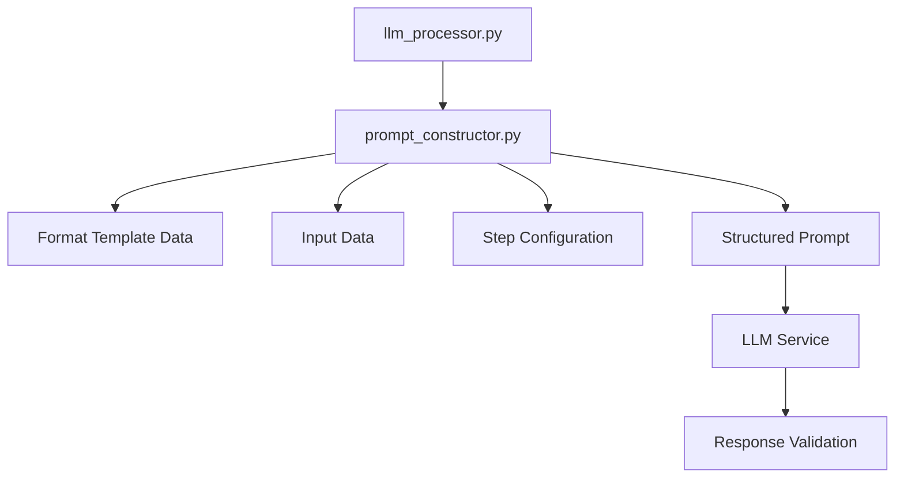

# Prompt Constructor Implementation Discussion

## Detailed Technical Analysis

### **Architecture Decisions**

#### **1. External Script vs. Module Integration**

**Option A: External Script (`prompt_constructor.py`)**
- **Pros:** Clear separation of concerns, easier testing, independent versioning
- **Cons:** Additional file complexity, potential import issues
- **Decision:** External script for better maintainability and testing

**Option B: Module Integration (within `llm_processor.py`)**
- **Pros:** Simpler file structure, no import complexity
- **Cons:** Mixed concerns, harder to test, less maintainable
- **Decision:** Rejected in favor of external script

#### **2. Data Flow Architecture**



#### **3. Error Handling Strategy**

**Hierarchical Error Handling:**
1. **Data Validation Errors:** Invalid format templates, missing data
2. **Construction Errors:** Template parsing, string formatting issues
3. **Integration Errors:** Import issues, function call failures
4. **Runtime Errors:** Memory issues, performance problems

### **Detailed Technical Specifications**

#### **1. Format Template Data Structure**

**Input Format Template:**
```python
{
    "id": 27,
    "name": "Title-description JSON (Input)",
    "description": "Structured JSON with two elements: title (string) and description (string).",
    "fields": {
        "type": "input",
        "schema": {
            "type": "object",
            "required": ["title", "description"],
            "properties": {
                "title": {"type": "string", "description": "The main title"},
                "description": {"type": "string", "description": "A description of the title"}
            }
        }
    },
    "llm_instructions": "The input will be provided as a JSON object with title and description fields. Process this input according to the specified schema requirements.",
    "created_at": "2025-06-29 10:23:51.020087",
    "updated_at": "2025-06-30 11:31:07.802536"
}
```

**Output Format Template:**
```python
{
    "id": 38,
    "name": "Plain text (GB) - Output",
    "description": "Plain text output using UK English spellings and idioms.",
    "fields": {
        "type": "output",
        "schema": {
            "type": "string",
            "description": "Plain text response"
        }
    },
    "llm_instructions": "Return your response as plain text using UK English spellings and idioms. Do not include any JSON formatting or special characters.",
    "created_at": "2025-06-29 10:23:51.020087",
    "updated_at": "2025-06-30 11:31:07.802536"
}
```

#### **2. Prompt Construction Algorithm**

**Step 1: Data Validation**
```python
def validate_input_data(data: Dict[str, Any]) -> ValidationResult:
    """
    Validate all input data before prompt construction.
    
    Checks:
    - Required fields present
    - Data types correct
    - Format templates valid
    - Step configuration complete
    """
```

**Step 2: Format Template Processing**
```python
def process_format_templates(
    input_template: Dict[str, Any],
    output_template: Dict[str, Any]
) -> ProcessedTemplates:
    """
    Extract and process format template data.
    
    Returns:
    - Input instructions and schema
    - Output instructions and schema
    - Validation status
    """
```

**Step 3: Input Field Mapping**
```python
def map_input_fields(
    raw_input: Dict[str, Any],
    step_config: Dict[str, Any],
    input_template: Dict[str, Any]
) -> MappedInput:
    """
    Map input fields according to step configuration.
    
    Handles:
    - Field name transformation
    - Data type conversion
    - Schema validation
    """
```

**Step 4: Prompt Assembly**
```python
def assemble_prompt(
    context_data: ContextData,
    task_data: TaskData,
    response_data: ResponseData
) -> str:
    """
    Assemble final prompt with proper formatting.
    
    Ensures:
    - Correct section headers
    - Proper spacing
    - Clear structure
    """
```

#### **3. Input Field Mapping Logic**

**Current Mapping Issues:**
- Uses "expanded idea" field instead of actual input field
- No field name transformation
- No data type validation

**Proposed Mapping Logic:**
```python
def transform_input_field(
    field_name: str,
    field_value: Any,
    step_config: Dict[str, Any]
) -> Tuple[str, Any]:
    """
    Transform input field name and value.
    
    Examples:
    - idea_seed -> Input1
    - title -> Input1
    - description -> Input2
    
    Returns: (transformed_name, transformed_value)
    """
```

**Field Name Mapping Rules:**
1. **Primary Field:** Always maps to "Input1"
2. **Secondary Fields:** Map to "Input2", "Input3", etc.
3. **Array Fields:** Expand into multiple inputs
4. **Object Fields:** Flatten into individual inputs

#### **4. Prompt Section Templates**

**CONTEXT Section Template:**
```
CONTEXT:
{system_prompt}

{input_format_instructions}

{input_format_description}
```

**TASK Section Template:**
```
TASK:
{task_prompt}

{input_data_section}
```

**RESPONSE Section Template:**
```
RESPONSE:
{output_format_instructions}

{output_format_description}
```

### **Implementation Considerations**

#### **1. Performance Optimization**

**String Concatenation Strategy:**
```python
# Efficient string building
def build_prompt_efficiently(sections: List[str]) -> str:
    """Use join() for efficient string concatenation."""
    return "\n\n".join(sections)
```

**Memory Management:**
```python
# Memory-efficient processing
def process_large_format_templates(template: Dict[str, Any]) -> Dict[str, Any]:
    """Process large format templates without memory issues."""
    # Use generators for large data
    # Stream processing for large prompts
```

#### **2. Error Recovery**

**Graceful Degradation:**
```python
def handle_missing_format_template(
    template_type: str,
    step_config: Dict[str, Any]
) -> Dict[str, Any]:
    """
    Handle missing format templates gracefully.
    
    Returns default template or raises appropriate error.
    """
```

**Partial Prompt Construction:**
```python
def build_partial_prompt(
    available_data: Dict[str, Any]
) -> str:
    """
    Build prompt with available data only.
    
    Skips missing sections and logs warnings.
    """
```

#### **3. Testing Strategy**

**Unit Test Coverage:**
- Format template extraction: 100%
- Input field mapping: 100%
- Prompt section building: 100%
- Error handling: 100%

**Integration Test Scenarios:**
- Complete workflow step processing
- Format template integration
- Error scenario handling
- Performance testing

**Manual Test Cases:**
- Real workflow steps with actual data
- Edge cases and error conditions
- Performance with large prompts
- User acceptance testing

### **Alternative Implementation Approaches**

#### **1. Template-Based Approach**

**Using Jinja2 Templates:**
```python
def build_prompt_with_templates(
    template_data: Dict[str, Any]
) -> str:
    """
    Use Jinja2 templates for prompt construction.
    
    Pros: Flexible, maintainable
    Cons: Additional dependency, complexity
    """
```

**Template Structure:**
```jinja2
CONTEXT:
{{ system_prompt }}

{{ input_format.llm_instructions }}
{{ input_format.description }}

TASK:
{{ task_prompt }}


{{ field_name }}:
{{ field_value }}


RESPONSE:
{{ output_format.llm_instructions }}
{{ output_format.description }}
```

#### **2. Configuration-Driven Approach**

**Using YAML Configuration:**
```yaml
prompt_sections:
  context:
    template: |
      CONTEXT:
      {system_prompt}
      
      {input_instructions}
    required: [system_prompt, input_instructions]
  
  task:
    template: |
      TASK:
      {task_prompt}
      
      {input_data}
    required: [task_prompt, input_data]
  
  response:
    template: |
      RESPONSE:
      {output_instructions}
    required: [output_instructions]
```

#### **3. Plugin-Based Approach**

**Modular Prompt Construction:**
```python
class PromptConstructorPlugin:
    """Base class for prompt construction plugins."""
    
    def build_section(self, data: Dict[str, Any]) -> str:
        """Build a specific prompt section."""
        raise NotImplementedError

class ContextSectionPlugin(PromptConstructorPlugin):
    """Plugin for building CONTEXT section."""
    
    def build_section(self, data: Dict[str, Any]) -> str:
        return f"CONTEXT:\n{data['system_prompt']}\n\n{data['input_instructions']}"

class TaskSectionPlugin(PromptConstructorPlugin):
    """Plugin for building TASK section."""
    
    def build_section(self, data: Dict[str, Any]) -> str:
        return f"TASK:\n{data['task_prompt']}\n\n{data['input_data']}"
```

### **Decision Matrix**

| Approach | Complexity | Maintainability | Performance | Flexibility | Recommendation |
|----------|------------|-----------------|-------------|-------------|----------------|
| External Script | Medium | High | High | High | ✅ **Recommended** |
| Template-Based | High | Medium | Medium | High | Consider for future |
| Configuration-Driven | Medium | High | High | Medium | Good alternative |
| Plugin-Based | High | High | Medium | Very High | Overkill for current needs |

### **Implementation Priority**

#### **Phase 1A: Core Implementation (Week 1)**
1. **Basic Prompt Constructor** - Essential functionality
2. **Format Template Extraction** - Core requirement
3. **Input Field Mapping** - Critical for correct prompts
4. **Basic Validation** - Error prevention

#### **Phase 1B: Integration (Week 2)**
1. **LLM Processor Integration** - Connect to existing system
2. **Error Handling** - Robust error management
3. **Logging Integration** - Diagnostic information
4. **Basic Testing** - Functionality validation

#### **Phase 2: Enhancement (Week 3)**
1. **Advanced Validation** - Comprehensive error checking
2. **Performance Optimization** - Efficiency improvements
3. **Comprehensive Testing** - Full test coverage
4. **Documentation** - Complete documentation

#### **Phase 3: Deployment (Week 4)**
1. **Staging Deployment** - Production-like testing
2. **Monitoring Setup** - Performance monitoring
3. **Production Deployment** - Live deployment
4. **Post-Deployment** - Monitoring and optimization

### **Success Metrics**

#### **Functional Metrics**
- **Prompt Quality:** 95% of prompts match desired structure
- **Error Rate:** <1% prompt construction failures
- **Performance:** <100ms prompt construction time
- **Compatibility:** 100% backward compatibility

#### **Quality Metrics**
- **Code Coverage:** >90% test coverage
- **Documentation:** Complete API documentation
- **Maintainability:** Clear code structure and comments
- **Usability:** Easy to use and understand

#### **Operational Metrics**
- **Deployment Success:** 100% successful deployments
- **Monitoring:** Real-time performance monitoring
- **Error Tracking:** Comprehensive error logging
- **User Feedback:** Positive user experience

### **Risk Assessment and Mitigation**

#### **Technical Risks**

**1. Format Template Complexity**
- **Risk:** Complex format templates may be difficult to integrate
- **Mitigation:** Start with simple templates, add complexity incrementally
- **Monitoring:** Track template complexity metrics

**2. Input Field Mapping**
- **Risk:** Complex field mappings may cause issues
- **Mitigation:** Comprehensive testing with various field types
- **Monitoring:** Log field mapping errors and success rates

**3. Performance Impact**
- **Risk:** Large prompts may impact performance
- **Mitigation:** Performance testing and optimization
- **Monitoring:** Track prompt construction time and memory usage

**4. Error Handling**
- **Risk:** Complex error scenarios may not be handled properly
- **Mitigation:** Comprehensive error handling and testing
- **Monitoring:** Track error rates and types

#### **Operational Risks**

**1. Integration Issues**
- **Risk:** Problems integrating with existing system
- **Mitigation:** Thorough integration testing
- **Monitoring:** Monitor integration points and error rates

**2. User Experience**
- **Risk:** Changes may negatively impact user experience
- **Mitigation:** User testing and feedback collection
- **Monitoring:** Track user satisfaction and usage metrics

**3. Deployment Issues**
- **Risk:** Deployment problems or rollback issues
- **Mitigation:** Staged deployment with feature flags
- **Monitoring:** Monitor deployment success and system health

### **Discussion Points and Open Questions**

#### **Technical Discussion Points**

1. **Template Approach:** Should we consider template-based approach for future flexibility?
2. **Performance Requirements:** What are the specific performance requirements?
3. **Testing Strategy:** How comprehensive should the testing be?
4. **Deployment Strategy:** Should we use feature flags for deployment?
5. **Monitoring Requirements:** What specific metrics should we track?

#### **Open Questions**

1. **Format Template Complexity:** How complex can format templates become?
2. **Input Field Mapping:** Are there edge cases we haven't considered?
3. **Error Handling:** What level of error recovery is acceptable?
4. **Performance:** What are the performance requirements for large prompts?
5. **Maintenance:** How will we maintain and update the prompt constructor?

#### **Stakeholder Considerations**

1. **Developer Experience:** How will this impact developer workflow?
2. **User Experience:** How will this improve user experience?
3. **Maintenance:** How will this impact long-term maintenance?
4. **Scalability:** How will this scale with future requirements?
5. **Cost:** What are the development and maintenance costs?

### **Next Steps and Recommendations**

#### **Immediate Actions Required**

1. **Technical Review:** Review implementation plan with team
2. **Resource Allocation:** Assign development resources
3. **Timeline Confirmation:** Confirm 4-week timeline
4. **Risk Assessment:** Finalize risk mitigation strategies

#### **Recommended Approach**

1. **Start Simple:** Begin with basic external script implementation
2. **Incremental Enhancement:** Add features incrementally
3. **Comprehensive Testing:** Test thoroughly at each stage
4. **User Feedback:** Gather feedback throughout development
5. **Documentation:** Document everything thoroughly

#### **Success Criteria**

1. **Functional:** All prompts match desired structure
2. **Performance:** Meets performance requirements
3. **Quality:** High code quality and test coverage
4. **User Experience:** Positive user feedback
5. **Maintainability:** Easy to maintain and extend

---

**Status:** Detailed implementation discussion complete
**Next Action:** Team review and decision on implementation approach
**Priority:** High - needed to complete format template system
**Estimated Effort:** 3-4 weeks for complete implementation
**Risk Level:** Medium - manageable with proper planning and testing 