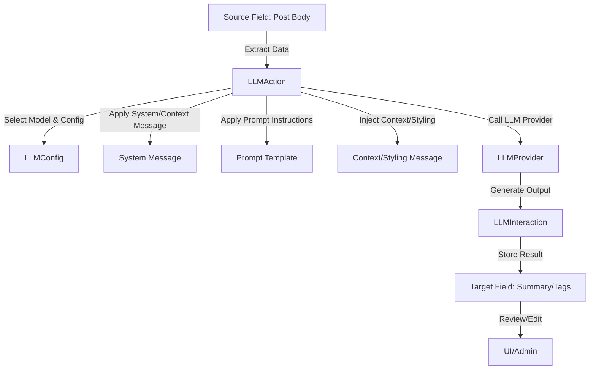

# Example: Custom LLM Task/Action Workflow

This page shows how you can construct a Task or Action that takes data from one field (e.g., a blog post body), applies a pre-constructed LLM process (with configurable model, system/context messages, prompt instructions, etc.), and outputs results into another field (e.g., summary, tags, or SEO description).

---

## Workflow Diagram

---

## Step-by-Step Process

1. **Define the Action/Task:**
   - Create an `LLMAction` in the database specifying:
     - Source field (e.g., `post.body`)
     - Target field (e.g., `post.summary`)
     - Model/provider to use (e.g., OpenAI GPT-4, Ollama Mistral)
     - System/context message (e.g., "You are a helpful summarizer...")
     - Prompt instructions (e.g., "Summarize the following text:")
     - Optional: context/styling message, temperature, max tokens, etc.

2. **Configure the Prompt:**
   - Use a stored `LLMPrompt` template, which can include variables for dynamic substitution (e.g., `{body}`).

3. **Execute the Action:**
   - The `LLMService` retrieves the action, prompt, and config.
   - It extracts the source field data, applies the system/context messages, and fills in the prompt template.
   - The configured provider/model is selected via `LLMFactory`.

4. **LLM Call & Output:**
   - The LLM is called with the constructed prompt and config.
   - The output is stored in the target field (e.g., `post.summary`).
   - The full interaction is logged in `LLMInteraction` for audit and review.

5. **Review & Edit:**
   - The result is shown in the UI for review, editing, or approval.
   - Admins can adjust prompts, configs, or rerun actions as needed.

---

**This workflow enables you to automate and customize LLM-powered content tasks, with full control over model selection, prompt engineering, and output handling.**

*For more advanced chaining, you can compose multiple actions/tasks, each with their own configs and prompts, to build complex content pipelines.* 