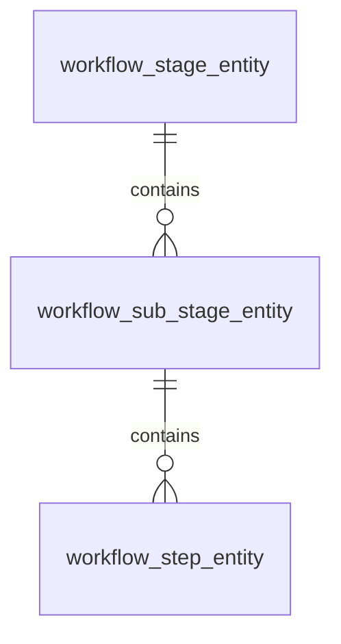

# Navigation System Database Structure

## Core Tables

### workflow_stage_entity
Primary table defining the main workflow stages.
- `id`: Primary key
- `name`: Stage name (e.g., "planning", "authoring", "publishing")
- `description`: Stage description
- `stage_order`: Integer defining the order of stages

### workflow_sub_stage_entity
Defines substages within each main stage.
- `id`: Primary key
- `stage_id`: Foreign key to workflow_stage_entity
- `name`: Substage name (e.g., "idea", "research", "structure")
- `description`: Substage description
- `sub_stage_order`: Integer defining the order within the stage

### workflow_step_entity
Defines individual steps within each substage.
- `id`: Primary key
- `sub_stage_id`: Foreign key to workflow_sub_stage_entity
- `name`: Step name (e.g., "Idea Seed", "Research Notes")
- `description`: Step description
- `step_order`: Integer defining the order within the substage

## Relationships and Hierarchy



## Canonical Structure

The database enforces this exact hierarchy:
1. Stage (e.g., "planning")
2. Substage (e.g., "idea")
3. Step (e.g., "Idea Seed")

## URL Structure
The database structure dictates the canonical URL format:
```
/workflow/<post_id>/<stage_name>/<substage_name>/<step_name>/
```

## Key Points
1. All navigation MUST be driven by these tables, not hardcoded values
2. The order fields (stage_order, sub_stage_order, step_order) MUST be respected
3. Names in URLs must exactly match the database names
4. No direct jumps allowed - must follow stage → substage → step hierarchy

## Current Database State

### 1. Planning Stage (stage_order: 1)
#### 1.1 Idea Substage (sub_stage_order: 1)
Steps:
- Idea Scope (step_order: 1)
- Idea Seed (step_order: 2)
- Initial (step_order: 3)
- Provisional Title (step_order: 4)

#### 1.2 Research Substage (sub_stage_order: 2)
Steps:
- Interesting Facts (step_order: 1)
- Research Notes (step_order: 2)
- Topics To Cover (step_order: 3)

#### 1.3 Structure Substage (sub_stage_order: 3)
Steps:
- Allocate Facts (step_order: 1)
- Main (step_order: 2)
- Section Headings (step_order: 3)
- Section Order (step_order: 4)
- Structure (step_order: 5)

### 2. Writing Stage (stage_order: 2)
#### 2.1 Content Substage (sub_stage_order: 1)
Steps:
- Sections (step_order: 1)

#### 2.2 Meta Substage (sub_stage_order: 2)
Steps:
- Main (step_order: 1)

#### 2.3 Images Substage (sub_stage_order: 3)
Steps:
- Main (step_order: 1)

### 3. Publishing Stage (stage_order: 3)
#### 3.1 Preflight Substage (sub_stage_order: 1)
Steps:
- Final Check (step_order: 1)
- Peer Review (step_order: 2)
- SEO Optimization (step_order: 3)
- Self Review (step_order: 4)
- Tartans Products (step_order: 5)

#### 3.2 Launch Substage (sub_stage_order: 2)
Steps:
- Deployment (step_order: 1)
- Scheduling (step_order: 2)
- Verification (step_order: 3)

#### 3.3 Syndication Substage (sub_stage_order: 3)
Steps:
- Content Adaptation (step_order: 1)
- Content Distribution (step_order: 2)
- Content Updates (step_order: 3)
- Engagement Tracking (step_order: 4)
- Feedback Collection (step_order: 5)
- Platform Selection (step_order: 6)
- Version Control (step_order: 7)

## Summary of Structure
- 3 Stages (Planning, Writing, Publishing)
- Each Stage has exactly 3 Substages
- Each Substage has 1 or more Steps
- All names and orders are preserved exactly as in database

## Notes
1. Each stage has exactly 3 substages
2. Legacy step names (e.g., "Initial") exist alongside current names but should not affect navigation
3. Some steps have generic names (e.g., "Main") used in multiple substages
4. Step orders have been updated to ensure uniqueness within each substage
5. All names must be used exactly as stored in database for URLs to work

## Migration Requirements
Any existing code using different names or structures MUST be updated to match this exact database structure. No exceptions or aliases allowed. 