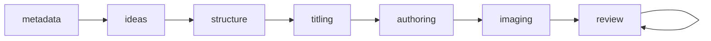
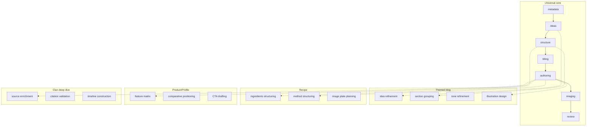

# W2 Stage/Substage Consolidation Proposal (v1)

**Instruction Set 10 — Report-only. No code changes.**  
This proposal is based strictly on `reports/W2_STAGE_SUBSTAGE_SYSTEM_INVENTORY.md`, current DB truth, and current code truth.

---

## 1) Canonical Stage Authority Decision

### 1.1 Authoritative Stage Field

**Decision: Model A — `post.workflow_stage` (the new column) becomes the single canonical authoring stage.**

**Technical reasoning:**

- **Single column, DB-enforced enum:** `post.workflow_stage` is a NOT NULL text column with a check constraint (`metadata`, `ideas`, `structure`, `titling`, `authoring`, `imaging`, `review`). One write path, one read path, no JSON key drift.
- **Legacy is fragmented:** `extra_settings->>'workflow_stage'` is optional (60 posts with null/empty in inventory); 18 posts have legacy values. Two write paths (set_workflow_stage vs advance_post_stage) and two read paths today; UI already shows early-stage, gates use legacy — consolidating on the column removes that split.
- **Content-quality semantics:** The seven early-stage values describe content progress (metadata → ideas → structure → titling → authoring → imaging → review). The legacy seven (idea → structured → drafted → imaged → essentials_complete → ready → published) mix content and operational state; “published” and “ready” belong to publishing/queue concern, not authoring stage. Making the column canonical keeps authoring strictly about content progress.
- **No new stage names:** The proposal keeps the existing early-stage names already in the DB constraint; no new enum values are introduced.

**Implications:**

| Area | Implication |
|------|-------------|
| **UI stage indicator** | The header “Stage: …” already reads from `/api/posts/<id>/early-stage` (post.workflow_stage). It remains the single source; no second indicator. All stage displays must read from this field or from an API that returns it. |
| **Automation gating** | Route gates (`require_workflow_stage`) today use legacy stages and `ROUTE_GATES` (idea, structured, drafted, …). Gates must be re-keyed to the canonical stages (metadata, ideas, structure, …) and must read from `post.workflow_stage`. Mapping: planning ↔ ideas + structure; authoring ↔ titling + authoring; imaging ↔ imaging; launchpad_essentials ↔ imaging + review; publish ↔ review (plus post.status / preflight). |
| **Publishing** | “Published” is not an authoring stage. On publish, post.status becomes published; post.workflow_stage stays at `review`. Optionally keep a one-time write to legacy extra_settings for backward compatibility during migration only; long term, publishing must not write authoring stage. |
| **Calendar** | Calendar remains week-centric; it must not write or infer post.workflow_stage. post_id in calendar URLs is for navigation only. No change to calendar_week_items.item_type (slot type, not post stage). |
| **Queue** | posting_queue.status stays as operational state (ready, published, etc.). Queue must not be used to infer or overwrite post.workflow_stage. Read path: if a feature needs “is this post ready for X?”, it must check post.workflow_stage (and preflight where applicable), not queue status alone. |

---

## 2) Unified Stage Graph (Core + Substages)

### 2.1 Universal Core Stages

Minimal universal stages (existing names; no new ones):

| Stage | Purpose | Entry condition | Exit condition | Auto-run? | Manual override? |
|-------|---------|-----------------|----------------|-----------|------------------|
| **metadata** | Post identity (title, subtitle, type) | Post created | title and subtitle set | No | N/A (initial) |
| **ideas** | Required ideas / angle | metadata met | ≥3 required ideas (post_required_idea) | Optional (LLM can suggest) | Yes — user can advance with override |
| **structure** | Section count and outline | ideas met | ≥3 sections exist (post_section) | Optional (LLM can suggest) | Yes |
| **titling** | Section headings | structure met | All sections have section_heading | Optional | Yes |
| **authoring** | Body content | titling met | At least one section has draft body | Optional (LLM drafts) | Yes |
| **imaging** | Section/post images | authoring met | Images optional for advance (relaxed) | Optional (generate) | Yes |
| **review** | Final check before publish | imaging met | — (terminal for authoring) | No | N/A |

- **Auto-run:** “Optional” means automation may run a substep (e.g. generate ideas, draft sections) but must not advance the core stage without an explicit advance call or documented override. Per hard constraint: no auto-advance without explicit call.
- **Manual override:** Where “Yes”, the Advance Stage action (or equivalent) can allow override so power users are not blocked by strict checks (e.g. advance with &lt;3 ideas for experimentation).

### 2.2 Post-Type-Specific Substages

Substages attach to the universal core; they do not change the core graph. Each is optional, attachable/detachable, and overridable manually (user can skip or reorder within guardrails).

| Post type | Substages (examples; not exhaustive) |
|-----------|--------------------------------------|
| **Themed blog** | Idea refinement, section grouping, tone refinement, illustration design, SEO snippet |
| **Recipe** | Ingredients structuring, method structuring, nutritional enrichment, image/plate planning |
| **Product/profile** | Feature matrix build, comparative positioning, CTA drafting |
| **Clan/family deep dive** | Source enrichment, citation validation, myth-vs-fact pass, timeline construction |

- Stored and driven by existing mechanism: `post_type_substages` / `output_channel_substages` and `get_substages_for_navbar`; `execute_substage` for automation.
- Substages do not define new core stages; they are steps within or alongside the core stage (e.g. “idea refinement” within ideas; “section grouping” within structure).

### 2.3 Mermaid Diagrams

**Unified core stage graph:**

**Substages attached per post type (conceptual):**

(Dotted lines indicate “substages attach to this core stage”; exact attachment is defined in post_type_substages config.)

---

## 3) Source-of-Truth Mapping Table

| Field / System | Authoritative? | Role | Keep / Deprecate / Derive | Notes |
|----------------|----------------|------|----------------------------|--------|
| **post.workflow_stage** | **Yes** (authoring) | Single canonical authoring stage for the post. | **Keep** | Only field that defines “where is this post in the content pipeline.” All gates and UI must read from here (or from an API that returns it). |
| **extra_settings.workflow_stage** | No | Legacy authoring stage; currently used by gates and automation. | **Deprecate** | After migration: gates and automation read post.workflow_stage. During transition: can be derived from post.workflow_stage for backward reads only. Then stop writing; eventually remove from read path. |
| **posting_queue.status** | Yes (operational) | Queue/slot operational state (ready, published, draft, failed, etc.). | **Keep** | Not authoring stage. Must never be used to infer or set post.workflow_stage. |
| **calendar_week_items.item_type** | Yes (slot type) | What kind of item is in the week slot (theme, idea, blog, recipe, etc.). | **Keep** | Not a post stage. Week-centric; must not override or infer post context. |
| **post_section.status** | Yes (section-level) | Per-section completeness (draft, complete). | **Keep** | Input to “can advance authoring stage” (e.g. authoring→imaging may check section content). Not a post-level stage. |
| **post_required_idea (count)** | Derived input | Feeds “ideas” stage exit condition (e.g. ≥3). | **Keep** | Not a stage store; it is data that stage logic reads. |
| **post_workflow_stage** (table) | No | Legacy workflow engine: post_id + stage_id. | **Deprecate** | Currently unused (workflow table empty). Do not use for new logic; document as deprecated; remove from active code paths. |
| **workflow** (table) | No | Legacy workflow engine: one row per post, stage_id. | **Deprecate** | Empty. Same as above. |
| **workflow_stage_entity** | No | Lookup for legacy stage names (planning, writing, authoring, header, publishing). | **Deprecate** | Only referenced by deprecated workflow tables. Keep table for historical data; do not use in new stage logic. |

---

## 4) Separation of Concerns Contract

Hard boundaries (X must never infer Y):

- **Publishing schedule must not infer authoring stage.** Calendar dates, publish_at, or “scheduled for week W” must not set or assume post.workflow_stage. Authoring stage is updated only by explicit advance (or by a documented migration/sync step).
- **Week calendar must not override post context.** In week view, theme/slot come from calendar_week_items and week context. Post data (including post.workflow_stage) must not be overwritten by week context. post_id in URL is for navigation only.
- **Queue status must not imply authoring readiness.** A queue row with status “ready” or “published” does not mean the post is at “review” or “published” in authoring terms. Readiness for publish must be computed from post.workflow_stage (and preflight) when needed, not from queue alone.
- **Authoring stage must not be set by automation except on explicit contract.** Automation may run substeps (e.g. generate ideas, draft sections). Advancing post.workflow_stage may only happen when the implementation explicitly documents it (e.g. “post creation sets workflow_stage = metadata” or “user clicks Advance Stage”). No silent auto-advance.
- **Section completeness must not define post stage by itself.** post_section.status (draft/complete) is an input to advance conditions (e.g. “all sections have titles”). It is not the source of truth for post.workflow_stage; the column post.workflow_stage is.

---

## 5) Migration & Compatibility Plan (No Code Yet)

- **Backfill strategy:** For posts where extra_settings.workflow_stage is set and post.workflow_stage is default/metadata: run a one-time mapping from legacy stage to canonical stage (idea→ideas, structured→structure, drafted→authoring, imaged→imaging, essentials_complete/ready→review, published→review). For posts with null/empty legacy, leave post.workflow_stage as-is (already metadata or current value). No backfill of legacy from canonical (we are deprecating legacy).
- **Read-path freeze:** Before changing gates: add a single “canonical stage” API or helper that returns post.workflow_stage (with optional fallback to extra_settings only for migration window). All new reads use that. Then switch require_workflow_stage and any other consumers to read from post.workflow_stage using a legacy→canonical map where needed.
- **Write-path freeze:** Identify all writers of extra_settings.workflow_stage (set_workflow_stage, advance_stage, ensure_workflow_stage_idea, publishing). Plan one commit that makes them write post.workflow_stage (and optionally keep writing legacy for one release). Then a follow-up commit stops writing legacy.
- **Feature-flag plan:** Optional. If desired: flag “use_canonical_stage” so gates and UI can switch to post.workflow_stage behind a flag; default off until backfill and verification done, then default on and remove legacy read path.
- **Verification steps:** (1) SQL: `SELECT workflow_stage, COUNT(*) FROM post GROUP BY 1;` — expect only canonical values. (2) SQL: after backfill, spot-check posts that had legacy idea/drafted/etc. have correct canonical stage. (3) curl: GET `/api/posts/<id>/early-stage` returns expected stage. (4) curl: POST advance-stage and confirm next stage; (5) curl: hit a gated route with post in wrong stage, expect 403; with correct stage, expect success.

---

## 6) Implementation Plan (Small Commit Plan)

**Commit 1: Canonical read path and gate mapping**

- **Files:** `utils/posts/workflow_stage.py` (or new `utils/posts/stage_authority.py`), `utils/posts/early_stage.py`, callers of `get_workflow_stage` / `require_workflow_stage`.
- **Change:** Introduce a single function e.g. `get_canonical_stage(post_id)` that returns post.workflow_stage (fallback to extra_settings only when column is default and legacy is set, for compatibility). Add mapping from canonical stages to route groups (e.g. planning allows ideas, structure; authoring allows titling, authoring; imaging allows imaging; launchpad_essentials allows imaging, review; publish allows review). Change `require_workflow_stage` to use get_canonical_stage and the new mapping.
- **Remove:** Nothing yet.
- **Verify:** SQL: `SELECT id, workflow_stage, extra_settings->>'workflow_stage' FROM post WHERE id = <test_id>;` curl: GET `/api/posts/<id>/early-stage`; curl: request to gated route with override=0, expect 403 when stage not allowed and 200 when allowed.
- **UI:** No change; UI already uses early-stage API. Behaviour: gates now enforce using canonical stage.

**Commit 2: New post creation and automation write one place**

- **Files:** `blueprints/posts.py`, `blueprints/planning_api_posts.py`, `blueprints/automation_core.py` (and any other that call ensure_workflow_stage_idea or set post stage on create).
- **Change:** On new post creation, set post.workflow_stage = 'metadata' (and optionally keep ensure_workflow_stage_idea for legacy extra_settings for one release). Ensure no code path sets only legacy without setting the column.
- **Remove:** Reliance on “idea” as first stage for new posts in legacy only; both column and (temporarily) legacy get a consistent starting point.
- **Verify:** Create new post via API or UI; SQL: `SELECT id, workflow_stage, extra_settings->>'workflow_stage' FROM post WHERE id = <new_id>;` expect workflow_stage = 'metadata'.
- **UI:** New posts show “Stage: metadata” in header.

**Commit 3: Advance-stage writes only post.workflow_stage**

- **Files:** `utils/posts/early_stage.py`, `blueprints/posts.py` (api_advance_early_stage). Optionally `utils/posts/workflow_stage.py` (advance_stage) to also write post.workflow_stage when advancing “legacy” for backward compatibility, or retire advance_stage for UI in favour of advance_post_stage only.
- **Change:** Ensure Advance Stage button only calls advance_post_stage (post.workflow_stage). If we still have api_advance_workflow_stage for legacy, either make it call the same canonical advance and sync legacy for one release, or document that it is deprecated.
- **Remove:** Dual advance paths that leave column and legacy out of sync.
- **Verify:** curl POST `/api/posts/<id>/advance-stage` with post at metadata (and conditions met); SQL: post.workflow_stage = 'ideas'. UI: “Stage: ideas” after advance.
- **UI:** Advance Stage button advances only canonical stage; header updates.

**Commit 4: Publishing and automation helpers**

- **Files:** `blueprints/launchpad/publishing.py`, `utils/posts/automation_helpers.py`.
- **Change:** On publish: do not set post.workflow_stage (leave at review); set post.status = published. Remove or redirect set_workflow_stage(post_id, 'published') to stop writing authoring stage. Automation helpers that advance “legacy” stage: make them advance post.workflow_stage via a single shared function (e.g. advance_post_stage or a dedicated “automation advance” that respects the same conditions), and optionally stop writing extra_settings.workflow_stage.
- **Remove:** Writing 'published' into any authoring stage field. Publishing is a status/queue outcome, not an authoring stage.
- **Verify:** Publish a post; SQL: post.status = published, post.workflow_stage = 'review' (unchanged). Queue row status = published.
- **UI:** Published posts show status published; stage still “review” (or UI can hide stage for published posts).

**Commit 5: Deprecate legacy read/write and optional backfill**

- **Files:** All readers of extra_settings->>'workflow_stage' for authoring (core.py governance, any remaining get_workflow_stage callers), and all writers (set_workflow_stage, ensure_workflow_stage_idea).
- **Change:** Remove fallback to extra_settings in get_canonical_stage. Run backfill script (separate migration or script) to set post.workflow_stage from legacy where column still default and legacy set. Then remove writes to extra_settings.workflow_stage (and workflow_stage_updated_at) for authoring. Document workflow / post_workflow_stage / workflow_stage_entity as deprecated.
- **Remove:** Legacy authoring stage from read path; all stage reads from post.workflow_stage. Stop writing extra_settings.workflow_stage for authoring.
- **Verify:** SQL: no post has extra_settings.workflow_stage updated after deployment for authoring. Grep for set_workflow_stage and ensure it no longer writes extra_settings (or only for non-authoring use if any). curl: gates and UI behave as in commit 1–4.
- **UI:** No visible change; single source of truth in DB.

---

## 7) Risk Assessment

**Top 5 structural risks**

1. **Gate mapping wrong:** New route-group-to-canonical-stage mapping might be too strict or too loose (e.g. block authoring when post is at “titling” but route expects “authoring”). Mitigation: table in code and in this doc; tests with one post per stage.
2. **Legacy readers not updated:** Some code path (e.g. report, export) might still read extra_settings.workflow_stage and make decisions. Mitigation: grep all reads; list in implementation plan; verify each.
3. **Automation assumes “idea” or “structured”:** Automation that checks legacy stage name will break when we only have “ideas”/“structure”. Mitigation: all automation must use get_canonical_stage and the same mapping.
4. **Backfill mistakes:** One-time mapping could mis-map (e.g. “drafted” → “authoring” is correct but “ready” → “review” might need to account for never-published). Mitigation: backfill in transaction; spot-check; keep backup.
5. **Double-write window:** If we write both column and legacy for a while, a bug could write one and not the other and reintroduce divergence. Mitigation: short window; single function that writes both during transition; then remove legacy write.

**Top 5 behavioural regressions likely**

1. **403 on routes that used to allow “idea”:** If mapping says “planning” requires “ideas” or “structure”, posts at “metadata” might get blocked where before they were allowed with legacy “idea”. Mitigation: align mapping with current ROUTE_GATES semantics; document; test.
2. **UI “Stage” out of sync after automation:** If automation still advances only legacy in a code path we miss, UI will show column (e.g. metadata) while automation thinks “drafted”. Mitigation: all automation advances go through one path that writes post.workflow_stage.
3. **Publish flow expects “published” stage:** Any UI or check that expects post to have authoring stage “published” after publish will break. Mitigation: Publish sets post.status; UI for published posts should not rely on authoring stage for “published” state.
4. **New post shows “metadata” but legacy code expects “idea”:** Callers that create a post and immediately check “workflow_stage == idea” will fail. Mitigation: Commit 2 sets consistent starting point; deprecate checks for legacy “idea” in favour of “metadata” or “ideas” as documented.
5. **Governance/summary blocks or badges wrong:** core.py governance uses get_workflow_stage for block_reason “stage_blocked”. If get_canonical_stage returns different value, governance might show different blocks. Mitigation: Verify governance after commit 1 with real data.

**Rollback method**

- **Code rollback:** Revert the 5 commits in reverse order (5→1). Restore require_workflow_stage to read extra_settings; restore set_workflow_stage/advance_stage to write extra_settings; restore publishing to set legacy ‘published’ if needed.
- **Data rollback:** No destructive backfill (we only backfill post.workflow_stage from legacy). If we had run backfill and need to “undo,” we do not overwrite legacy from column; we just revert code so that legacy is read again. If a deploy wrote only post.workflow_stage and did not write legacy, then re-deploying old code will “see” stale legacy until next write; acceptable for rollback.
- **Exact commands (example):** `git revert <commit5> <commit4> <commit3> <commit2> <commit1> --no-commit && git commit -m "Rollback W2 stage consolidation"` then deploy. No SQL rollback required for post.workflow_stage column (it can keep current values).

---

## 8) Executive Summary (One Page)

- **Number of current stage systems:** Multiple: (1) legacy authoring in extra_settings.workflow_stage, (2) early-stage in post.workflow_stage, (3) queue status, (4) section status, (5) substage config/DB, (6) legacy workflow tables. Two are primary for “post progress”: legacy (gates/automation) and early-stage (UI).
- **Proposed final number:** One **authoring** stage system: **post.workflow_stage** only. Queue status, section status, and calendar item_type remain but are **not** authoring stage. Substages remain as attachable steps. Legacy authoring (extra_settings) and legacy workflow tables are deprecated.
- **What becomes simpler:** Single read for “where is this post?” Single write path for advance. No UI vs gate split. One list of stages (metadata→review); no second list (idea→published) for authoring.
- **What becomes stricter:** Gates and automation must use the same canonical stages and the same read/write path. Publishing must not write authoring stage. Calendar and queue must not infer or set authoring stage. No auto-advance without an explicit call.
- **Why this supports non-generic LLM content refinement:** Content progress (metadata, ideas, structure, titling, authoring, imaging, review) is explicit and per-post. Substages stay post-type-specific (themed, recipe, profile, clan) so LLM steps can be tailored. Authoring stage is never silently advanced by automation, so human review points are clear. Operational state (queue, publish) is separate so “ready for publish” can be defined by stage + preflight, not by queue alone.

---

## 9) Hard Constraints (Compliance)

- **No new stage names unless justified:** None introduced; we use the existing seven in post.workflow_stage (metadata, ideas, structure, titling, authoring, imaging, review).
- **No duplication of stage fields:** After migration, only post.workflow_stage holds authoring stage; extra_settings.workflow_stage is deprecated and not written.
- **No ambiguous semantics:** “Authoring stage” = post.workflow_stage. “Queue status” = posting_queue.status. “Section status” = post_section.status. “Slot type” = calendar_week_items.item_type. Each has one meaning.
- **No auto-advance without explicit call:** Advance happens only via explicit user action (Advance Stage) or via a documented, intentional automation step that we explicitly add (e.g. post creation = metadata); no silent background advance.
- **No UI-only stage illusions:** UI displays only what is in post.workflow_stage (or returned by the canonical API). No client-only stage state that contradicts the DB.

---

**End of proposal. No code has been changed.**
