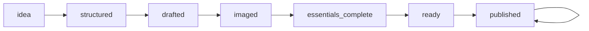
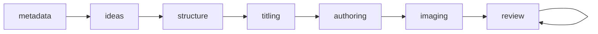

# W2 Stage/Substage System Inventory

**Instruction Set 9 — Report-only.**  
Every substantive claim is backed by (a) a DB query output snippet or (b) a file path + function name + short excerpt.

---

## 9.1 DB truth: what stages actually exist in data

### A) Post table structure (stage-related columns)

```text
                                                      Table "public.post"
                Column                |            Type             | Collation | Nullable |              Default               
--------------------------------------+-----------------------------+-----------+----------+------------------------------------
 id                                   | integer                     |           | not null | nextval('post_id_seq'::regclass)
 ...
 substage_id                          | integer                     |           |          | 
 ...
 extra_settings                       | jsonb                       |           |          | 
 ...
 workflow_stage                       | text                        |           | not null | 'metadata'::text
...
Check constraints:
    "post_workflow_stage_valid" CHECK (workflow_stage = ANY (ARRAY['metadata'::text, 'ideas'::text, 'structure'::text, 'titling'::text, 'authoring'::text, 'imaging'::text, 'review'::text]))
```

**Stage-related columns on `post`:**
- **`substage_id`** — integer, nullable (FK to substage table; not inspected in this report).
- **`extra_settings`** — jsonb; legacy `workflow_stage` and `workflow_stage_updated_at` live here.
- **`workflow_stage`** — text, NOT NULL, default `'metadata'`; constrained to the seven early-stage values.

---

### B) Distinct values for the legacy stage model (extra_settings)

```text
 workflow_stage | n  
----------------+----
                | 60
 idea           | 15
 drafted        |  1
 imaged         |  1
 published      |  1
(5 rows)
```

Query: `SELECT extra_settings->>'workflow_stage' AS workflow_stage, COUNT(*) AS n FROM post GROUP BY 1 ORDER BY n DESC, workflow_stage NULLS LAST;`

**Related keys in extra_settings:**

```text
                  key                  | n  
---------------------------------------+----
 workflow_stage                        | 18
 workflow_stage_updated_at             | 18
 expanded_idea_prompt_name             | 13
 brainstorm_prompt_name                |  7
 section_structure_prompt_name         |  7
 section_titling_prompt_name           |  7
 topic_allocation_prompt_name          |  7
 section_drafting_prompt_name          |  2
 imaging                               |  1
 paused                                |  1
 profile_section_structure_prompt_name |  1
(11 rows)
```

Query: `SELECT key, COUNT(*) AS n FROM (SELECT jsonb_object_keys(extra_settings) AS key FROM post WHERE extra_settings IS NOT NULL AND extra_settings != '{}'::jsonb) t GROUP BY 1 ORDER BY n DESC, key ASC;`

So legacy stage is stored in **`post.extra_settings->>'workflow_stage'`**; 60 posts have no value (NULL/empty), 18 have a value (idea, drafted, imaged, published).

---

### C) New early-stage model (post.workflow_stage column)

```text
 workflow_stage | n  
----------------+----
 metadata       | 77
 structure      |  1
(2 rows)
```

Query: `SELECT workflow_stage, COUNT(*) AS n FROM post GROUP BY 1 ORDER BY n DESC, workflow_stage;`

Allowed values are enforced by check constraint: `metadata`, `ideas`, `structure`, `titling`, `authoring`, `imaging`, `review`.

---

### D) Where else stages are tracked

**Tables list (excerpt):** `\dt` shows `post`, `posting_queue`, `calendar_week_items`, `post_section`, `post_images`, `post_workflow_stage`, `workflow`, `workflow_stage_entity`, `post_workflow_sub_stage`, `workflow_sub_stage_entity`, `post_type_substages`, `output_channel_substages`, `substage_metadata`, `substage_automation_settings`, etc.

#### posting_queue

- **Structure:** Has `status` (character varying(20), default `'ready'`). **No `workflow_stage` column.**
- **Distinct status values:**

```text
  status   | count 
-----------+-------
 ready     |    91
 failed    |    80
 published |    59
 generated |    22
 draft     |    11
 cancelled |     6
 scheduled |     2
 pending   |     2
 approved  |     1
(9 rows)
```

#### calendar_week_items

- **Structure:** Has `item_type` (varchar), `priority` (varchar), `metadata` (jsonb). **No `workflow_stage` or `status` column.** Item types are slot types (theme, idea, blog, recipe, profile, etc.), not post workflow stages.
- **Distinct item_type:**

```text
   item_type   | count 
---------------+-------
 idea          |    97
 weekly_phrase |    52
 weekly_word   |    52
 special_event |    45
 annual_event  |     7
 theme         |     3
 profile       |     2
 blog          |     2
(8 rows)
```

#### post_section

- **Structure:** Has `status` (text, default `'draft'`). **No `workflow_stage` column.**
- **Distinct status:**

```text
  status  | count 
----------+-------
 draft    |   116
 complete |     7
(2 rows)
```

#### post_images

- **Structure:** Links post/section to image_archive; has `image_type`, no status/stage column.

#### post_workflow_stage (legacy workflow engine)

- **Structure:** `post_id`, `stage_id` (FK to `workflow_stage_entity`), `started_at`, `completed_at`, `status` (varchar(32)).
- **workflow_stage_entity** (id, name, stage_order): sample names — `planning`, `writing`, `authoring`, `header`, `publishing`.
- **workflow** table: `post_id`, `stage_id`, `status` (workflow_status_enum). Query `SELECT status, COUNT(*) FROM workflow GROUP BY 1` returned **(0 rows)** — table exists but is empty.

**Summary (9.1 D):** Stage-like state is stored in: **post** (column `workflow_stage` + `extra_settings.workflow_stage`), **posting_queue.status**, **post_section.status**, and **workflow** / **post_workflow_stage** (entity/stage tracking). Calendar and post_images do not store workflow stage.

---

## 9.2 Code truth: where stages/substages are defined and advanced

### A) Search hits (file paths and representative snippets)

**Pattern: `workflow_stage|substage|stage_`** (Python, top hits):

| File | Representative use |
|------|---------------------|
| `blueprints/posts.py` | `api_advance_workflow_stage`, `api_get_workflow_stage`; calls `advance_stage`, `get_workflow_stage` from `utils.posts.workflow_stage` |
| `utils/posts/workflow_stage.py` | `STAGES`, `ROUTE_GATES`, `get_workflow_stage`, `set_workflow_stage`, `advance_stage`, `require_workflow_stage` |
| `utils/posts/early_stage.py` | `EARLY_STAGES`, `get_early_stage`, `advance_post_stage`; reads/writes `post.workflow_stage` |
| `blueprints/automation_core.py` | `execute_substage(stage, substage)`; validates substage for output channel |
| `blueprints/core.py` | Uses `extra_settings->>'workflow_stage'` and `get_workflow_stage` for governance; `block_reason = "stage_blocked"` |
| `blueprints/planning_calendar_clean.py` | Post used for “navigation through pipeline stages” only in week view |
| `blueprints/launchpad/publishing.py` | `set_workflow_stage(post_id, 'published', actor='publish')` |

Snippet — **utils/posts/workflow_stage.py** (stages and gates):

```python
STAGES: List[str] = [
    "idea", "structured", "drafted", "imaged", "essentials_complete", "ready", "published",
]
ROUTE_GATES = {
    "planning": {"idea", "structured"},
    "authoring": {"structured", "drafted"},
    "imaging": {"drafted", "imaged"},
    "launchpad_essentials": {"imaged", "essentials_complete"},
    "publish": {"essentials_complete", "ready", "published"},
}
```

Snippet — **utils/posts/early_stage.py** (early stages and advance):

```python
EARLY_STAGES = [
    "metadata", "ideas", "structure", "titling", "authoring", "imaging", "review",
]
# advance_post_stage() updates post.workflow_stage only on explicit user action
cursor.execute(
    "UPDATE post SET workflow_stage = %s, updated_at = CURRENT_TIMESTAMP WHERE id = %s",
    (next_stage, post_id),
)
```

**Pattern: `advance_.*stage|set_.*stage|update_.*stage|compute_.*stage`:**

| File | Function |
|------|----------|
| `blueprints/posts.py` | `api_advance_workflow_stage` → `advance_stage`; `api_advance_early_stage` → `advance_post_stage` |
| `utils/posts/workflow_stage.py` | `advance_stage`, `set_workflow_stage`, `_compute_highest_valid_stage` |
| `utils/posts/early_stage.py` | `advance_post_stage` |
| `utils/posts/automation_helpers.py` | `advance_stage` (legacy) |
| `blueprints/launchpad/publishing.py` | `set_workflow_stage(post_id, 'published', ...)` |

**Pattern: `one-click|1-click|pipeline|automation.*stage|stage.*gate|preflight`:**

| File | Use |
|------|-----|
| `static/js/shared/blog-pipeline-header.js` | Pipeline title/nav; `updateEarlyStageIndicator()`; “post_id is only for navigation through pipeline stages” |
| `templates/shared/blog_pipeline_header.html` | “1-click” link; `one-click-link` |
| `blueprints/automation_core.py` | Blueprint prefix `/launchpad/one-click-publication/api`; registers `automation_pipeline` |
| `blueprints/core.py` | `preflight_ok`, `validate_post_for_clan_publish`, `block_reason = "preflight_failed"` |
| `utils/posts/workflow_stage.py` | `_preflight_ok(post_id)` used in readiness/advance logic |

---

### B) Source-of-truth map

| Stage system | Storage | Enum / allowed values | Primary writer(s) | Primary reader(s) | UI surfaces | Automation dependencies |
|--------------|---------|------------------------|-------------------|-------------------|-------------|--------------------------|
| Legacy workflow_stage (extra_settings) | `post.extra_settings->>'workflow_stage'` | `idea`, `structured`, `drafted`, `imaged`, `essentials_complete`, `ready`, `published` — in `utils/posts/workflow_stage.py` `STAGES` | `workflow_stage.set_workflow_stage`, `advance_stage`; `ensure_workflow_stage_idea` (posts, planning_api_posts, automation_core) | `workflow_stage.get_workflow_stage`; core.py (governance), require_workflow_stage | Legacy UI that shows workflow_stage from API | Route gates in `require_workflow_stage`; automation_helpers.advance_stage; publishing sets `published` |
| Early-stage (post.workflow_stage) | `post.workflow_stage` (column) | `metadata`, `ideas`, `structure`, `titling`, `authoring`, `imaging`, `review` — in `early_stage.EARLY_STAGES` and DB check constraint | `early_stage.advance_post_stage` (only on explicit Advance) | `early_stage.get_early_stage`; API GET `/api/posts/<id>/early-stage` | `blog_pipeline_header.html` (“Stage: …”), `blog-pipeline-header.js` `updateEarlyStageIndicator()` | None (no automation writes this column) |
| Calendar slot type | `calendar_week_items.item_type` | theme, idea, blog, recipe, profile, weekly_word, weekly_phrase, etc. | Planning/calendar APIs that create/update calendar_week_items | Week view, ideas view | `templates/planning/calendar/*` | Not a post stage; slot assignment |
| Queue status | `posting_queue.status` | ready, failed, published, generated, draft, cancelled, scheduled, pending, approved | Queue population and publishing logic | Queue manager UI, automation | Queue/launchpad templates | Posting pipeline reads status |
| Section status | `post_section.status` | draft, complete | Section authoring/imaging flows | Section UIs, readiness checks | Imaging/authoring templates | Used in legacy _meets_drafted / completion checks |
| Legacy workflow engine | `workflow.stage_id`, `post_workflow_stage.stage_id` → `workflow_stage_entity` | planning, writing, authoring, header, publishing (by name) | Not actively used in current code paths (workflow table empty) | — | — | — |
| Substages (navbar/pipeline) | DB: `post_type_substages`, `output_channel_substages`; config: `config/output_channel_stages.py`, `utils/substage_config.py` | Per (post_type, stage): e.g. topic_brainstorming, section_structure, author_first_drafts | Substage management, migration from config | `get_substages_for_navbar`, pipeline status API | Navbar, one-click pipeline UI | `automation_core.execute_substage`; `validate_substage_for_output` |

---

### C) Mandatory files: present or not

| Path | Present | Key functions / notes |
|------|---------|------------------------|
| `utils/posts/workflow_stage.py` | **Yes** | `get_workflow_stage`, `set_workflow_stage`, `advance_stage`, `require_workflow_stage`, `_compute_highest_valid_stage`, `_preflight_ok`; stores in `extra_settings` |
| `utils/posts/early_stage.py` | **Yes** | `get_early_stage`, `advance_post_stage`; reads/writes `post.workflow_stage` |
| Pipeline/planning for `/planning/posts/<id>/calendar/*` | **Yes** | `blueprints/planning_calendar_clean.py`: `planning_calendar_week_view`, `planning_calendar_ideas` — post_id only for “navigation through pipeline stages” |
| `planning_calendar_clean.py` | **Yes** | As above; no stage writes in calendar views |
| `static/js/shared/blog-pipeline-header.js` | **Yes** | `updateEarlyStageIndicator()`, pipeline title/nav; week vs post context guards |
| Templates under `templates/planning/calendar/` | **Yes** | e.g. `week_view.html`, `ideas.html`; include blog_pipeline_header |
| `blueprints/automation_core.py` | **Yes** | `execute_substage(stage, substage)`; one-click API prefix; calls `ensure_workflow_stage_idea` on create |
| `blueprints/automation_execute.py` | **Yes** | Uses `require_workflow_stage(post_id, "authoring"|"imaging"|…) for gates |
| `blueprints/automation_pipeline.py` | **Yes** | Pipeline status API; post_type + output channel; does not write post.workflow_stage |
| `utils/automation*` | **Partial** | No directory `utils/automation/`; **`utils/posts/automation_helpers.py`** exists: `advance_stage`, `set_automation_last_run` |
| `utils/content_roles*` | **Yes** | **`utils/content_roles/`** exists (e.g. `authority_short_generator.py`); content_roles used by posting_queue and planning |

---

## 9.3 Stage graphs and overlaps

### 1) Legacy stage graph (extra_settings.workflow_stage)

- **Stages (order):** idea → structured → drafted → imaged → essentials_complete → ready → published.


- **Transitions:**
  - **Manual/API:** `advance_stage(post_id, target, actor="ui")` via `api_advance_workflow_stage`; `set_workflow_stage` from publishing on publish.
  - **Automation:** `utils/posts/automation_helpers.advance_stage`; automation_core calls `ensure_workflow_stage_idea` on post creation (sets idea).
- **Gates:** `require_workflow_stage(post_id, route_group)` with `ROUTE_GATES`: planning (idea, structured); authoring (structured, drafted); imaging (drafted, imaged); launchpad_essentials (imaged, essentials_complete); publish (essentials_complete, ready, published). Block returns `stage_blocked`, 403.
- **Preflight:** `_preflight_ok(post_id)` used to allow advance to ready; failure blocks advance.

### 2) Early-stage graph (post.workflow_stage)

- **Stages (order):** metadata → ideas → structure → titling → authoring → imaging → review.


- **Transitions:** Only **manual:** `advance_post_stage(post_id)` via POST `/api/posts/<id>/advance-stage`. No automation writes this column.
- **Gates:** `_condition_met(post_id, from_stage, cursor)` — e.g. metadata→ideas: title+subtitle; ideas→structure: ≥3 required ideas; structure→titling: ≥3 sections; titling→authoring: all sections have titles; authoring→imaging: ≥1 section has body; imaging→review: always allowed.

### 3) Where they conflict or overlap

- **Two stage systems on the same post:** Legacy in `extra_settings.workflow_stage` (idea/structured/drafted/…) and early-stage in `post.workflow_stage` (metadata/ideas/structure/…). UI shows early-stage in header (“Stage: …”); route gates and automation use **legacy** stages. So: “UI shows X (early-stage) but automation and gates use Y (legacy).”
- **Calendar vs post context:** `blog-pipeline-header.js` and planning_calendar_clean: in calendar week view, data is week-centric; post_id is only for navigation. If code mixed week theme/slot with post context, week context could “leak” into post context; the code explicitly avoids fetching post for week view and uses post only when not in calendar week view.
- **Queue vs post stage:** posting_queue has its own `status` (ready, published, …); it does not read `post.workflow_stage` or `extra_settings.workflow_stage`. So “queue can think ready/published while post legacy/early stage disagrees” if not kept in sync elsewhere.

---

## 9.4 Fitness for LLM-assisted non-generic posts

- **Content-quality vs operational:** Early-stage (metadata→review) is mostly **content-quality** (title, ideas, structure, titling, authoring, imaging, review). Legacy stages mix **content** (idea, structured, drafted, imaged) and **operational** (essentials_complete, ready, published). So: early-stage is clearer for “where is the content”; legacy is used for “can we run automation / show this route / publish.”
- **Post-type specific vs universal:** Substages are **post-type specific** (themed, recipe, profile, generated) via `post_type_substages` and `get_substages_for_navbar`. Legacy and early-stage **stages** are **universal** (same list for all post types); gates and conditions are same logic for all (e.g. section count, required ideas).
- **Week context leaking into post context:** Design and code (planning_calendar_clean, blog-pipeline-header.js) say post_id in calendar is for navigation only and week view does not load post data; theme/title come from week or explicit post fetch when not in week view. Remaining risk: any code that infers “current post theme” from week slot without checking context could still leak; the report does not redesign, only notes the guard exists.
- **Safe to automate vs manual:** Early-stage advances **only** on explicit user action (Advance Stage button) — safe. Legacy is advanced by automation_helpers and by publishing; route gates and preflight protect which routes/actions run. Automation that advances legacy stage is already in use; early-stage is deliberately not auto-advanced.
- **Minimum flexible core for post types:** Themed blog: legacy or early-stage both support idea→draft→image→publish flow. Recipe: strict format; planning redirects recipe to authoring; substages differ. Product-type profile: same universal stages; profile-specific substages/config. Clan/family deep dive: same; no separate stage list. So the **minimum flexible core** is: one ordered stage list (or aligned legacy+early), post-type-specific substeps (substages), and route gates keyed to that list. Today two lists exist and are not unified.

---

## 9.5 Stop point and next action

### One-page summary

- **Current systems:** (1) **Legacy** workflow_stage in `post.extra_settings` (7 stages, idea→published); (2) **Early-stage** in `post.workflow_stage` (7 stages, metadata→review); (3) **Queue status** on posting_queue; (4) **Section status** on post_section; (5) **Substage** config/DB for navbar and automation; (6) **Legacy workflow engine** tables (workflow, post_workflow_stage, workflow_stage_entity) present but workflow table empty. So **multiple** stage/status systems exist; two are primary for “post progress”: legacy (gates/automation) and early-stage (UI indicator).
- **Top 5 risks/confusions:** (1) Two stage systems (legacy vs early) can diverge; UI shows early, gates use legacy. (2) New posts: early-stage defaults to metadata, legacy set to idea in several code paths — inconsistent. (3) Queue status independent of post stage — can show ready/published while post stage disagrees. (4) Substages are rich and post-type-specific; stages are universal but not aligned between legacy and early. (5) workflow_stage_entity/post_workflow_stage unused in current flows — dead or future use unclear.
- **Top 5 quick wins:** (1) Document which system is authoritative for which feature (gates vs UI). (2) On “Advance Stage” (early-stage), optionally sync legacy to a corresponding stage where defined. (3) Ensure new post creation sets both legacy and early-stage to a consistent starting point. (4) Add a single “stage” read that returns one canonical view for UI (e.g. prefer early-stage when available). (5) Remove or clearly mark workflow/workflow_stage_entity usage so it’s not mistaken for the main model.
- **Proposed next step (not written here):** **“Stage/Substage consolidation proposal (v1)”** — to define one canonical stage model, migration from legacy/early dual model, and how queue/substages align.

---

## 9.6 Git discipline

- This instruction set is **report-only**. No code was changed to produce this report. If in a future run any code change is required (e.g. to run a query or script), it must be (1) called out as “unavoidable for reporting”, (2) in its own commit with message prefix **W2: ops-only for stage inventory**, and (3) described in this report.
